# 2.1. UML Estática

## Introdução

A **modelagem estática** captura o que o sistema *é* em um instante qualquer: que entidades existem, como elas se compõem e onde elas são executadas — isto é, a estrutura que não depende da passagem do tempo (Fowler, 2003). Nesta entrega, o Battle Class é descrito estaticamente por três diagramas complementares da UML 2.5.1:

| Diagrama | Nível de abstração | Pergunta que responde |
|---|---|---|
| **Classes** | Domínio / código | *Que conceitos e relacionamentos existem?* |
| **Componentes** | Arquitetura de software | *De que blocos o sistema é montado?* |
| **Implantação** | Infraestrutura | *Onde cada bloco roda em produção?* |

Cada diagrama amplia a "lente" do anterior: Classes olha para o interior de um componente; Componentes agrupa classes em unidades de *deploy*; Implantação posiciona esses componentes em *nodes* físicos ou virtuais.

## Metodologia

- **Fontes:** loop Estudar→Ganhar moedas→Jogar TD→Repetir (Design Sprint) e BPMN do back-end (Entrega 01).
- **Ferramenta:** draw.io / diagrams.net, versionado em PNG/JPEG em [`docs/assets/diagramas/estatica/`](../assets/diagramas/estatica/).
- **Autoria e revisão:** cada diagrama teve um *owner* (individual ou dupla) que produziu a versão inicial; os demais membros comentaram o artefato (ver *Comprobatórios de Participação* abaixo) e o *owner* consolidou a V2 final.

---

## 2.1.1. Diagrama de Classes

### Definição

Um **Diagrama de Classes** é um grafo rotulado $G = (V, E, \ell)$ onde $V$ é o conjunto de classes (ou interfaces) e $E$ representa os relacionamentos — *associação*, *agregação*, *composição*, *generalização* e *dependência* — rotulados por multiplicidades e papéis (Booch et al., 2005). Ele é o artefato central da *view lógica* do 4+1 de Kruchten e o ponto de partida para qualquer modelagem orientada a objetos.

### Aplicação no Battle Class

O modelo de domínio foi organizado em torno de cinco agregados principais, seguindo recomendações de **Domain-Driven Design** (Evans, 2003):

| Agregado | Raiz | Membros principais |
|---|---|---|
| **Identidade** | `Usuario` | `Estudante`, `Professor`, `Admin` (herança por especialização) |
| **Conhecimento** | `Taxonomia` | hierarquia recursiva Área → Disciplina → Tópico; `Questao` + 5 `Alternativa` |
| **Economia** | `Carteira` | `MoedaQuestao` (persistente, ganha por acerto) |
| **Partida** | `Partida` | `Onda`, `Heroi`, `Torre`, `Mapa`, `MoedaOuroPartida` (volátil, reiniciada por partida) |
| **Ranking** | `Ranking` | pontuações derivadas da `Carteira` e das partidas |

A separação entre **`MoedaQuestao`** (acumulada permanentemente na `Carteira`) e **`MoedaOuroPartida`** (gerada e gasta dentro de uma única `Partida`) é *dogmática* no domínio: foi decidida na Design Sprint (Perguntas 8 e 9) e materializada em duas classes distintas justamente para impedir que a modelagem abra brecha para as duas se misturarem.

> Para esta entrega, os artefatos versionados da equipe no Foco 1 são os Diagramas de **Componentes** e **Implantação** (abaixo). As classes de domínio descritas acima servem de base conceitual compartilhada, referenciadas tanto pelos componentes (Foco 1) quanto pelos pacotes (Foco 3) e pelos diagramas comportamentais (Foco 2).

### Comprobatórios de Participação (Diagrama de Classes)

| Membro | Comentário / evidência |
|---|---|
| Ana Elisa | 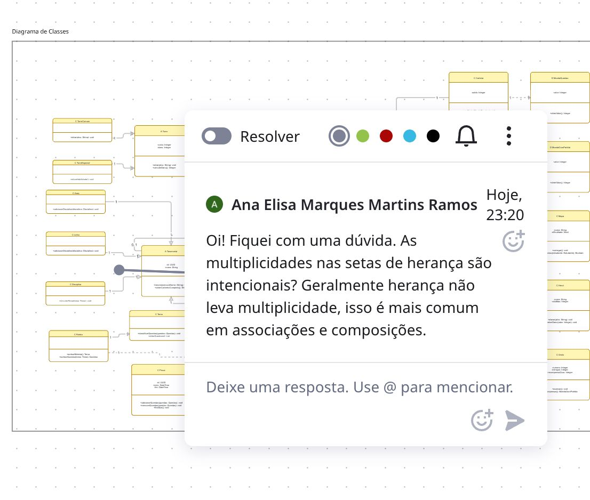 |
| Gabriela Tiago | 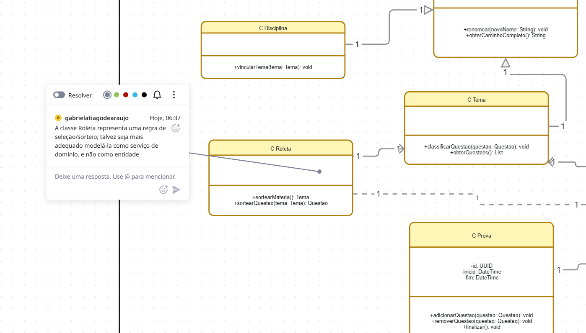 |

---

## 2.1.2. Diagrama de Componentes

### Definição

O **Diagrama de Componentes** modela o sistema como um conjunto de **componentes** — unidades modulares, substituíveis e com *interfaces* explícitas — e suas dependências (Fowler, 2003). Cada componente expõe *interfaces fornecidas* (lollipop ⚬) e consome *interfaces requeridas* (soquete ⊂). É a principal ferramenta para raciocinar sobre **acoplamento** e **coesão** em nível de arquitetura.

### Aplicação no Battle Class

O back-end foi decomposto em **oito componentes lógicos** + um *subsystem* de infraestrutura (Supabase), de modo que cada motor de jogo ou serviço transversal ficasse encapsulado atrás de uma interface clara:

| Componente | Responsabilidade | Usa |
|---|---|---|
| `AuthService` | Login, cadastro e emissão de token (via Supabase Auth) | Supabase Auth |
| `GestaoUsuarios` | CRUD de perfil e permissões (Estudante/Professor/Admin) | `AuthService`, Supabase DB |
| `BancoDeQuestoes` | CRUD e consulta de questões por taxonomia | Supabase DB |
| `MotorRoleta` | Seleção aleatória ponderada de questão por filtro | `BancoDeQuestoes` |
| `SistemaEconomia` | Crédito/débito de `MoedaQuestao` na carteira | `GestaoUsuarios`, Supabase DB |
| `MotorTowerDefense` | Loop de partida, ondas, heróis, torres e `MoedaOuroPartida` | `SistemaEconomia` |
| `Ranking` | Agregação de acertos/moedas para leaderboard | `SistemaEconomia` |
| `Front-end Web (React)` | UI mobile-first — consome todas as interfaces acima | HTTPS REST/JSON |

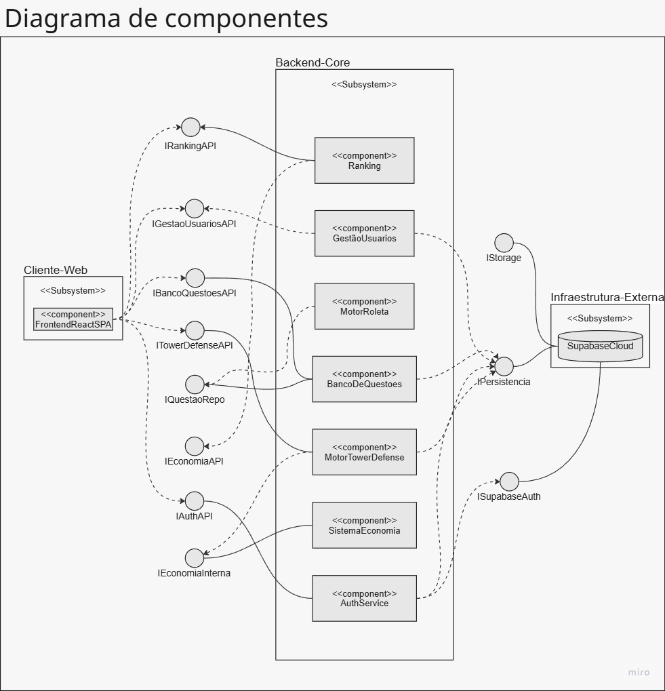

### Senso Crítico

- **Deploy único, fronteiras claras:** manter os 8 componentes em um único processo Express simplifica o MVP; mas como cada um tem interface explícita, extrair `MotorTowerDefense` para um serviço próprio no futuro é uma mudança localizada.
- **Supabase como fronteira externa:** tratar `Supabase Auth` e `Supabase DB` como componentes "externos" torna o diagrama honesto sobre dependências de infraestrutura e abre espaço para, se preciso, trocar o fornecedor sem mudar os motores.
- **Ausente de propósito:** não modelamos componentes de *cache*, *CDN* ou *observabilidade* — foge do escopo da Entrega 02 e inflaria o diagrama sem acrescentar valor à compreensão do domínio.

### Comprobatórios de Participação (Diagrama de Componentes)

| Membro | Comentário / evidência |
|---|---|
| Ana Elisa | 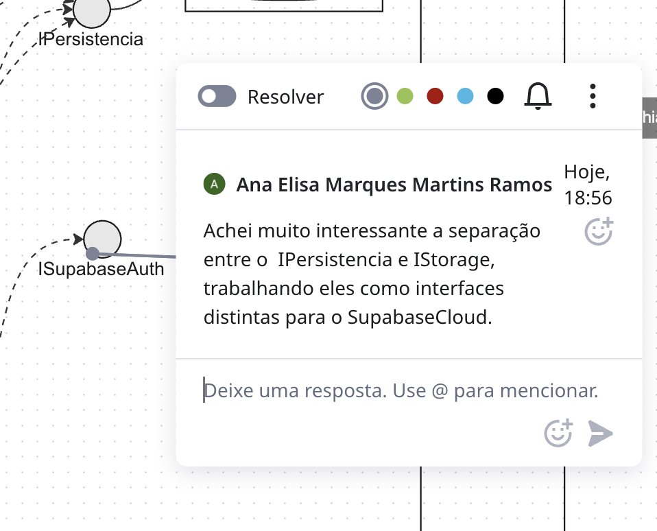 |
| João Sapiência | 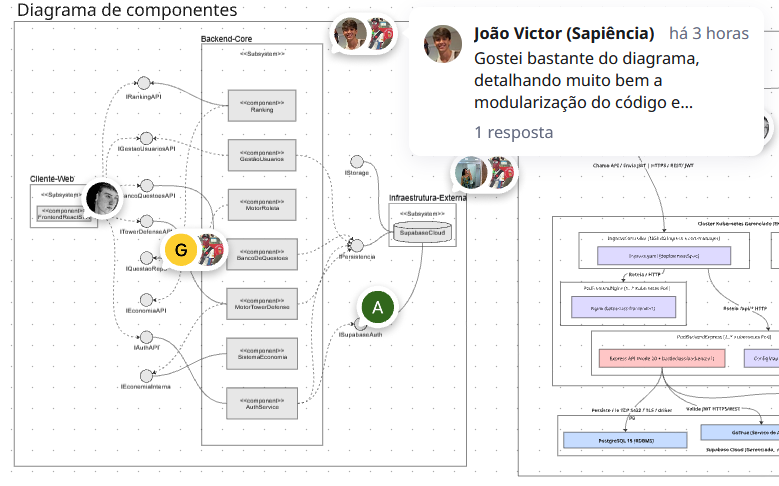 |
| Marina | 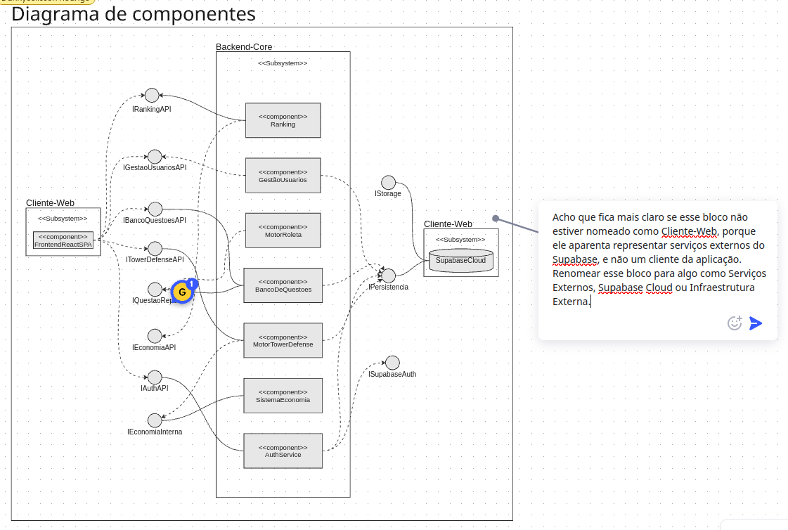 |
| Thiago | 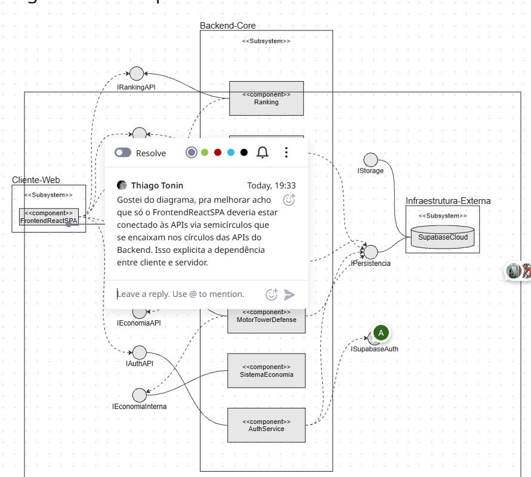 |

---

## 2.1.3. Diagrama de Implantação

### Definição

O **Diagrama de Implantação** descreve a topologia física/virtual onde o sistema roda: **nodes** (máquinas, containers, *cloud services*) conectados por *paths* de comunicação, contendo *artifacts* (binários, imagens, arquivos) que materializam os componentes do diagrama anterior (Booch et al., 2005). Ele responde à pergunta operacional *"se eu derrubar este nó, o que para de funcionar?"*.

### Aplicação no Battle Class

A topologia escolhida reflete a decisão do grupo por **PaaS + BaaS gerenciado**, mantendo operação simples e alinhada ao escopo da disciplina:

- **Dispositivo do usuário** (browser mobile) → serve o *bundle* React estático.
- **Kubernetes Cluster** → *pods* do back-end Express (TypeScript), expostos por um *Ingress*.
- **Supabase Cloud** → Postgres gerenciado, Supabase Auth e Storage.
- **Comunicação:** HTTPS/REST entre cliente ↔ Ingress ↔ back-end; JDBC/pg-wire entre back-end ↔ Supabase.

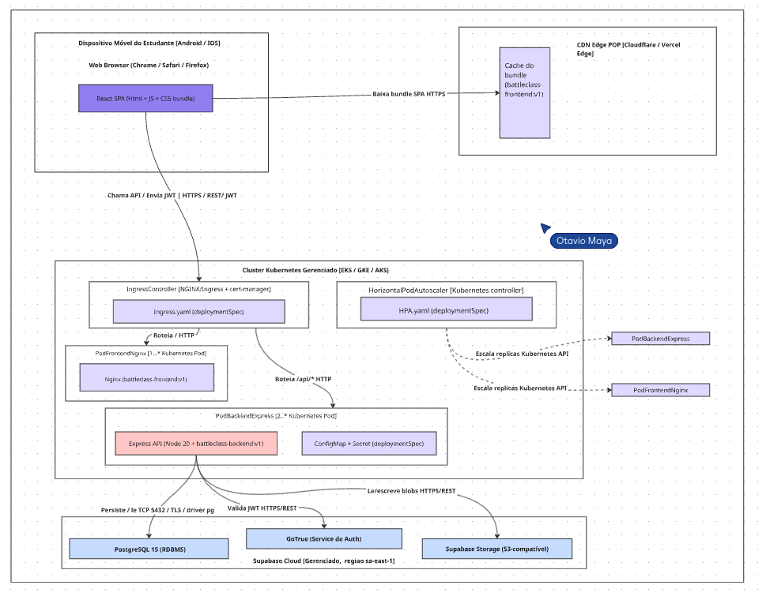

### Senso Crítico

- **Por que Kubernetes e não serverless?** Queremos autonomia para empacotar os motores juntos e escalar horizontalmente quando o `MotorTowerDefense` for sensível a latência. Serverless introduziria *cold start* desnecessário para o MVP.
- **Por que Supabase em vez de Postgres self-hosted?** Economia de 1-2 semanas de ops em troca de *lock-in* moderado. Como toda a comunicação passa por `AuthService` e consultas SQL padrão, a fronteira para troca é pequena.
- **Ponto frágil:** o *single cluster* é ponto único de falha. Para produção real, recomendaríamos pelo menos dois *availability zones* — fora do escopo acadêmico.

### Comprobatórios de Participação (Diagrama de Implantação)

| Membro | Comentário / evidência |
|---|---|
| Ana Elisa | 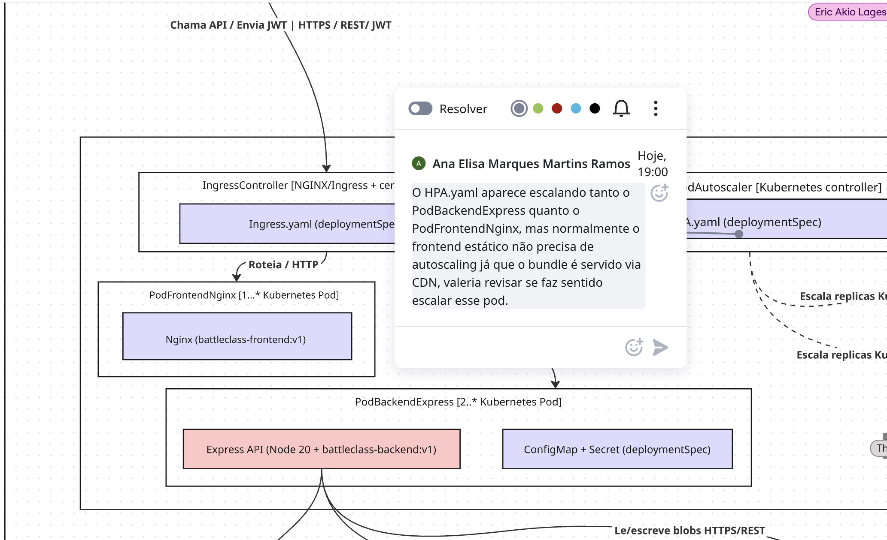 |
| Dannyeclisson | 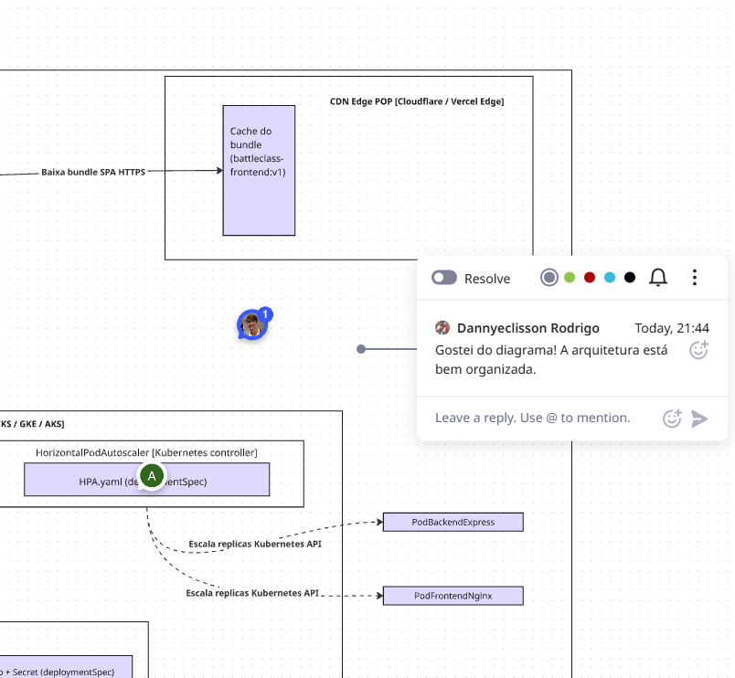 |
| João Sapiência | 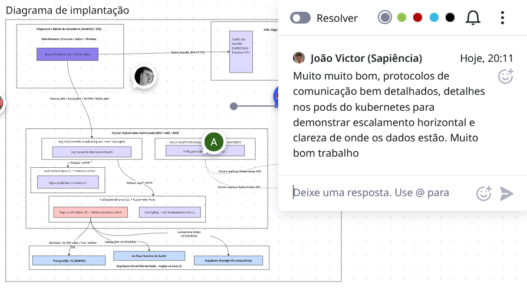 |
| Thiago | 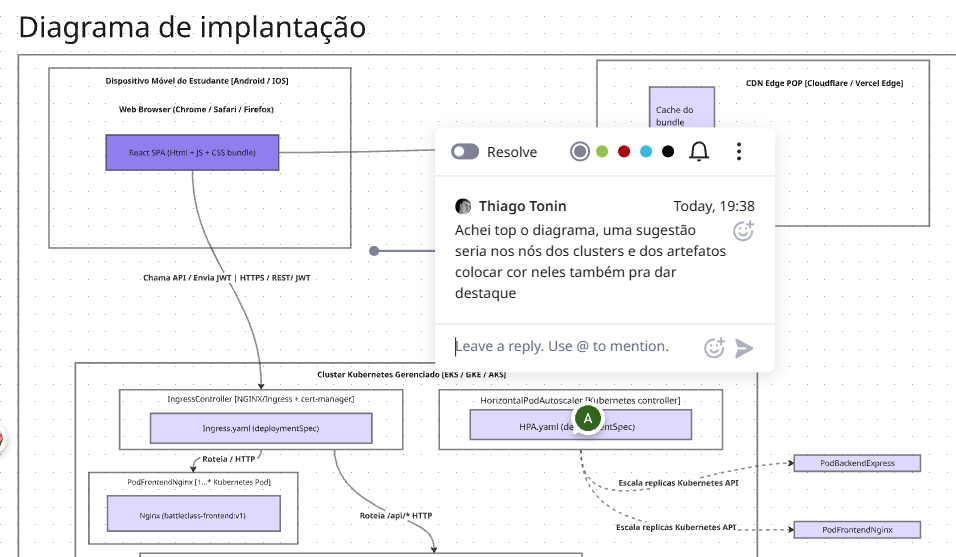 |

---

## Rastreabilidade e Elos com Outros Artefatos

- **BPMN (Entrega 01, §1.3)** → os *pools* viraram componentes no §2.1.2; a separação entre fluxos "estudar" e "jogar" sobrevive nos componentes `MotorRoleta` e `MotorTowerDefense`.
- **Design Sprint, Pergunta 9** ("moedas consumíveis dentro da partida") → justifica a existência das duas classes `MoedaQuestao` / `MoedaOuroPartida` no modelo de domínio e a fronteira entre `SistemaEconomia` e `MotorTowerDefense` no diagrama de componentes.
- **[2.2. UML Dinâmica](/Modelagem/2.2.ModelagemDinamica.md)** → cada *lifeline* dos diagramas de Sequência corresponde a um componente definido aqui (ex.: `MotorRoleta` participa da sequência "Responder Questão").
- **[2.3. UML Organizacional](/Modelagem/2.3.ModelagemOrganizacionalCasosDeUso.md)** → os pacotes do Foco 3 agrupam classes deste Foco 1 por domínio (Identidade, Conhecimento, Economia, Partida, Ranking).

## Senso Crítico Geral

A modelagem estática foi onde a equipe pagou menos tempo em ida-e-volta: as decisões arquiteturais da Design Sprint (stack, loop de jogo, monólito back-end) já haviam convergido. O principal trabalho aqui foi **tornar explícito** o que estava implícito: separar as duas moedas, definir interfaces entre motores e nomear os *nodes* de infra. Em contrapartida, **não detalhamos** atributos e operações no Diagrama de Classes com rigor (não modelamos, por exemplo, tipos primitivos de cada campo) — esse nível de granularidade cabe ao código que ainda será escrito, e duplicá-lo aqui transformaria a *view* estática num dicionário de dados redundante.

## Histórico de Versões

| Versão | Data | Descrição | Autor(es) | Revisor(es) |
|---|---|---|---|---|
| 1.0 | 24/04/2026 | Consolidação dos 3 diagramas estáticos e comprobatórios | João Sapiência, Marina, Ana Elisa, Thiago, João Lobo, Otávio, Gabriela | Equipe G6 |

## Referências

- OBJECT MANAGEMENT GROUP (OMG). **OMG Unified Modeling Language (UML) — Version 2.5.1**. 2017. Disponível em: https://www.omg.org/spec/UML/2.5.1
- BOOCH, Grady; RUMBAUGH, James; JACOBSON, Ivar. **The Unified Modeling Language User Guide**. 2. ed. Addison-Wesley, 2005.
- FOWLER, Martin. **UML Distilled**. 3. ed. Addison-Wesley, 2003.
- LARMAN, Craig. **Applying UML and Patterns**. 3. ed. Prentice Hall, 2004.
- EVANS, Eric. **Domain-Driven Design: Tackling Complexity in the Heart of Software**. Addison-Wesley, 2003.
- KRUCHTEN, Philippe. **The 4+1 View Model of Architecture**. IEEE Software, v. 12, n. 6, p. 42–50, 1995.
