# 2.2. UML Dinâmica

## Introdução

Enquanto a modelagem estática responde *"do que o sistema é feito?"*, a **modelagem dinâmica** (ou comportamental) responde *"o que ele faz ao longo do tempo?"*. Descreve fluxos de interação entre objetos, regras de transição de estado e sequências de atividades executadas para realizar um caso de uso (Booch, Rumbaugh & Jacobson, 2005). Cada diagrama comportamental é uma *lente* diferente sobre o mesmo cenário — e é o contraste entre essas lentes que revela inconsistências no desenho.

Nesta entrega a equipe produziu **quatro diagramas comportamentais** — todos centrados no cenário ***"Responder Questão"***, que é o núcleo do loop de jogo do Battle Class:

| Diagrama               | Foco temporal                   | Pergunta que responde                                        |
| ---------------------- | ------------------------------- | ------------------------------------------------------------ |
| **Sequência**          | *Quando* cada mensagem acontece | *Qual é a ordem das chamadas entre objetos?*                 |
| **Atividades**         | Fluxo de controle               | *Qual é o fluxograma do processo?*                           |
| **Comunicação**        | *Quem* fala com quem            | *Qual é a topologia das mensagens?*                          |
| **Máquina de Estados** | Estado interno                  | *Quais estados um objeto assume e o que dispara transições?* |

A decisão de concentrar os quatro diagramas no **mesmo cenário** (com uma segunda máquina de estados dedicada à `Partida` de TD) foi deliberada: permite que o leitor faça *cross-check* das quatro representações e evita divergência entre as *views*.

## Metodologia

- **Fontes:** BPMN da Entrega 01 e fluxo do protótipo de alta fidelidade.
- **Ferramentas:** draw.io para Sequência, Atividades e Estados; Miro para Comunicação.
- **Autoria e revisão:** cada diagrama teve um *owner* (individual ou dupla) que produziu a V1; os demais membros comentaram o artefato (ver comprobatórios em cada sub-seção) e o *owner* consolidou a V2 incorporando as sugestões. Os quatro diagramas deste foco (Sequência, Atividades, Comunicação e Máquina de Estados) têm a **V2 arquivada**; três deles (Sequência, Comunicação, Máquina de Estados) mantêm também a V1 no repositório para auditoria.
- **Evidências:** arquivos em [`docs/assets/diagramas/estatica/`](../assets/diagramas/estatica/) (pasta única mantida por simplicidade, apesar do nome).

---

## 2.2.1. Diagrama de Sequência

### Definição

Um **Diagrama de Sequência** representa a interação entre objetos ao longo do tempo numa linha vertical (time axis), com cada objeto sob uma *lifeline* e cada chamada como uma *seta rotulada* (Fowler, 2003). Formalmente, uma sequência é uma tripla $(O, M, \prec)$, onde $O$ é o conjunto de *lifelines*, $M$ o conjunto de mensagens e $\prec$ uma ordem parcial temporal entre mensagens. É o diagrama mais usado na prática para documentar *contratos* entre componentes.

### Aplicação no Battle Class — Cenário "Responder Questão"

Foram produzidas **três sequências** (V1/V2 cada) para cobrir os três momentos do cenário:

| Arquivo                      | Momento modelado                                                        |
| ---------------------------- | ----------------------------------------------------------------------- |
| `DiagramadeSequencia1V2.pdf` | Seleção da prova/disciplina + giro da roleta → exibição da questão      |
| `DiagramadeSequencia2V2.pdf` | Jogador responde → sistema valida → feedback (acerto/erro + explicação) |
| `DiagramadeSequencia3V2.pdf` | Crédito de `MoedaQuestao` na `Carteira` → retorno ao loop               |

As *lifelines* envolvidas são: `Estudante`, `Front-end`, `MotorRoleta`, `BancoDeQuestoes`, `SistemaEconomia` e `Carteira` — **exatamente os componentes** do diagrama de [2.1.2 Componentes](/Modelagem/2.1.ModelagemEstatica.md).

📄 **V2 (versão final) — visualizador embutido:**

**Sequência 1 — Seleção e roleta**

<object data="../assets/diagramas/estatica/DiagramadeSequencia1V2.pdf" type="application/pdf" width="100%" height="720px">
  
Seu navegador não consegue exibir o PDF embutido. <a href="../assets/diagramas/estatica/DiagramadeSequencia1V2.pdf">Abrir DiagramadeSequencia1V2.pdf em nova aba</a>.

</object>

**Sequência 2 — Responder e validar**

<object data="../assets/diagramas/estatica/DiagramadeSequencia2V2.pdf" type="application/pdf" width="100%" height="720px">
  
Seu navegador não consegue exibir o PDF embutido. <a href="../assets/diagramas/estatica/DiagramadeSequencia2V2.pdf">Abrir DiagramadeSequencia2V2.pdf em nova aba</a>.

</object>

**Sequência 3 — Crédito e retorno ao loop**

<object data="../assets/diagramas/estatica/DiagramadeSequencia3V2.pdf" type="application/pdf" width="100%" height="720px">
  
Seu navegador não consegue exibir o PDF embutido. <a href="../assets/diagramas/estatica/DiagramadeSequencia3V2.pdf">Abrir DiagramadeSequencia3V2.pdf em nova aba</a>.

</object>

> **Versões iniciais (V1)**, mantidas no repositório para fins de rastreabilidade: [V1-1](../assets/diagramas/estatica/DiagramadeSequencia1V1.pdf) · [V1-2](../assets/diagramas/estatica/DiagramadeSequencia2V1.pdf) · [V1-3](../assets/diagramas/estatica/DiagramadeSequencia3V1.pdf).

### Senso Crítico

- **Três sequências em vez de uma só:** partir o cenário em três mantém cada diagrama legível (máx ~12 mensagens) e permite revisar uma etapa sem mexer nas demais.
- **V1 → V2:** a V1 tinha a validação acontecendo no front-end. A V2 move para o back-end (`BancoDeQuestoes` é a autoridade do gabarito), eliminando risco de trapaça — ponto levantado na revisão por pares.
- **O que não modelamos:** erro de rede, *timeout* e *retry*. Ficou fora porque não é foco do desenho de sistema, e sim de resiliência — pertence a uma *view* de runtime futura.

### Comprobatórios de Participação (Diagrama de Sequência)

| Membro         | Comentário / evidência                                                                                                                                                                           |
| -------------- | ------------------------------------------------------------------------------------------------------------------------------------------------------------------------------------------------ |
| Ana Elisa      | 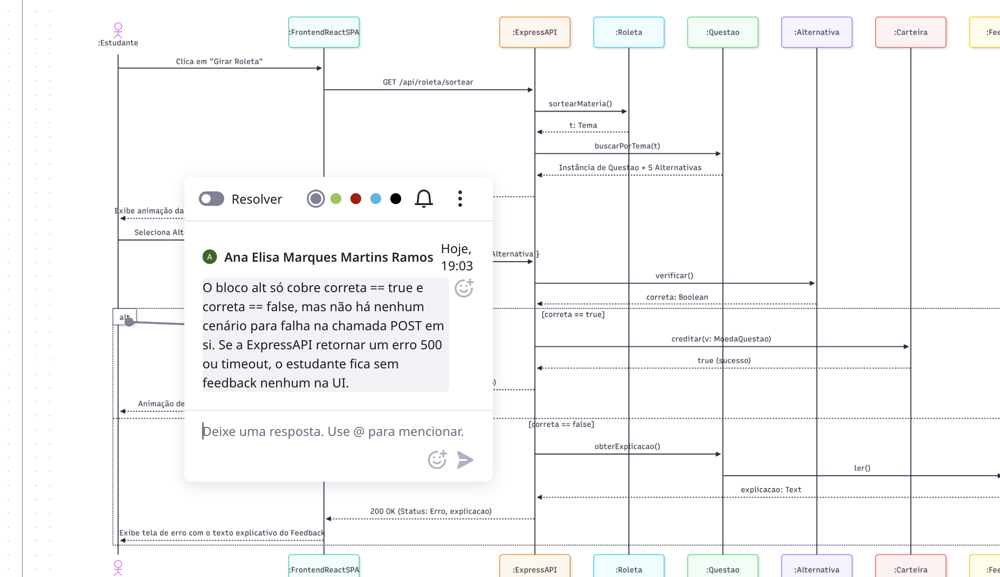                                                                                                               |
| Dannyeclisson  | 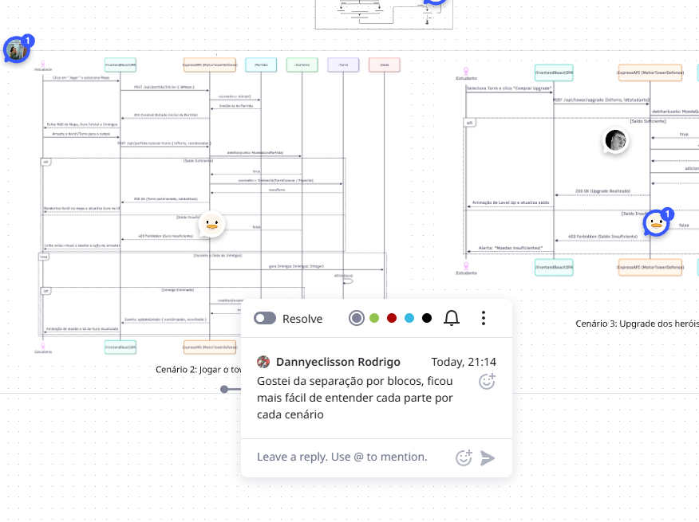                                                                                                    |
| Gabriela Tiago | 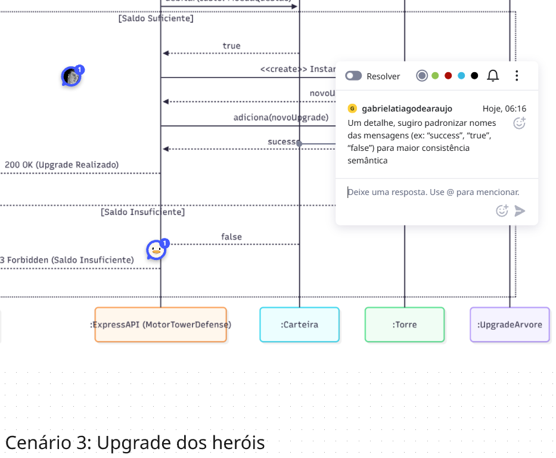                                                                                                     |
| João Lobo      | 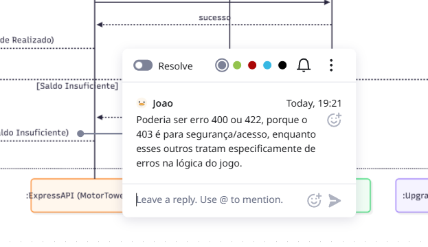 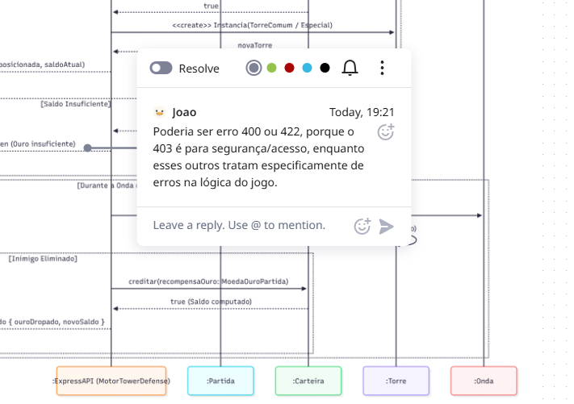 |
| Lucas Oliveira | 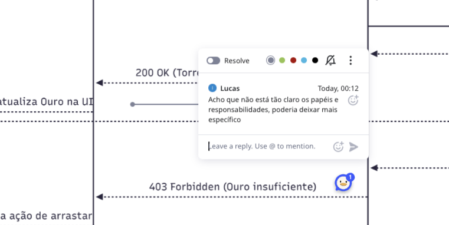                                                                                                           |
| Marina         | 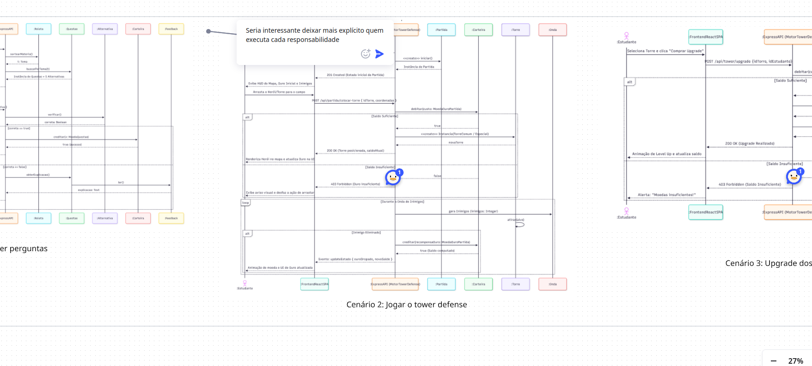                                                                                                         |
| Thiago         | 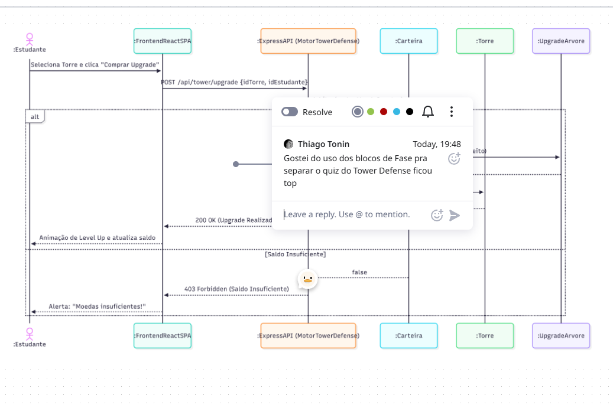                                                                                                                   |

---

## 2.2.2. Diagrama de Atividades

### Definição

O **Diagrama de Atividades** descreve o fluxo de controle de um processo como um grafo orientado com *nodes* (atividades) e *edges* (transições), incluindo bifurcações por *decision*, paralelismo por *fork/join* e raias (*swimlanes*) que atribuem cada atividade a um responsável (Fowler, 2003). É equivalente, em expressividade, ao BPMN — e por isso serve de ponte entre a *view* de processos de negócio e a de software.

### Aplicação no Battle Class — Loop Macro

O diagrama abrange o **loop completo** de uma sessão do estudante: do login ao encerramento, passando pelo ciclo Estudar → Moedas → TD → Repetir, inclusive as decisões "jogar TD agora?", "ver explicação do erro?" e "encerrar sessão?".

Pelo tamanho do diagrama completo, a imagem original ficou ilegível em tela única — por isso, o fluxo foi recortado em três partes sequenciais abaixo. A versão inteira continua disponível em [`DiagramaAtividades.PNG`](../assets/diagramas/estatica/DiagramaAtividades.PNG).

**Parte 1 — Sessão de estudo e seleção de questão.** Estudante → `IniciarSessãoEstudo` → `SelecionarProva` → `AcionarRoleta` → `SortearMatéria` → `BuscarQuestão` → Região Interruptível com `ExibirQuestão` → `LerEnunciado` → `SelecionarAlternativa` → `ConfirmarResposta`.

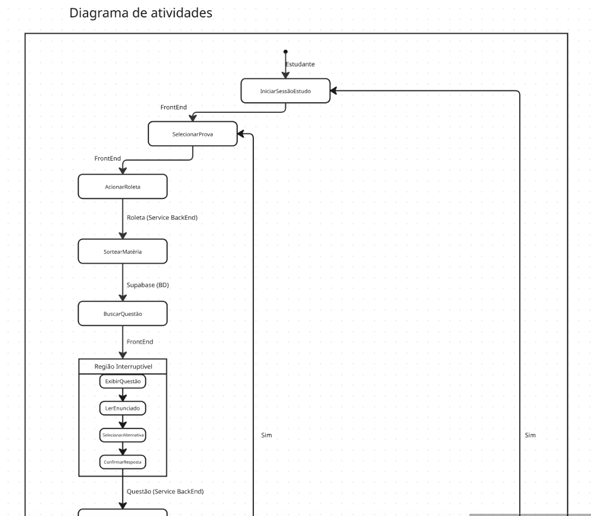

**Parte 2 — Avaliação da resposta e crédito de moedas.** `ConfirmarResposta` → `AvaliarResposta` (Questão Service BackEnd) → decisão `Acertou?` → `Sim`: `CreditarMoedas` → `UpdateCarteira` (Economia Service BackEnd); `Não`: `RegistrarErro`. Ambos os caminhos convergem em `ContinuarEstudando`.

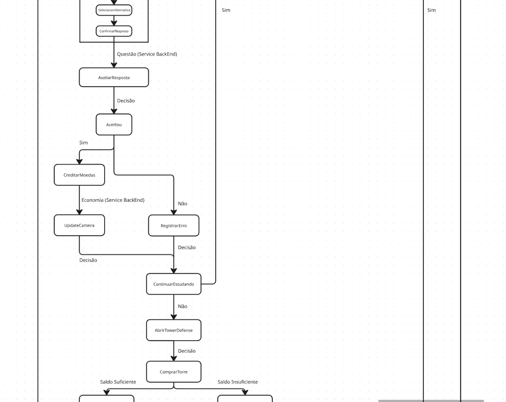

**Parte 3 — Tower Defense e loop.** `ContinuarEstudando` → `AbrirTowerDefense` → `ComprarTorre` → decisão de saldo (`ColocarTorreMapa` / `TorresComuns`) → Processamento em Paralelo (`GerarOndas` + `ProcessarAçõesJogador`) → `Vitória` / `Derrota` → `TelaVitória` com `BonificarMoedaQuestao` ou `TelaDerrota` → decisão `NovaRodada?`.

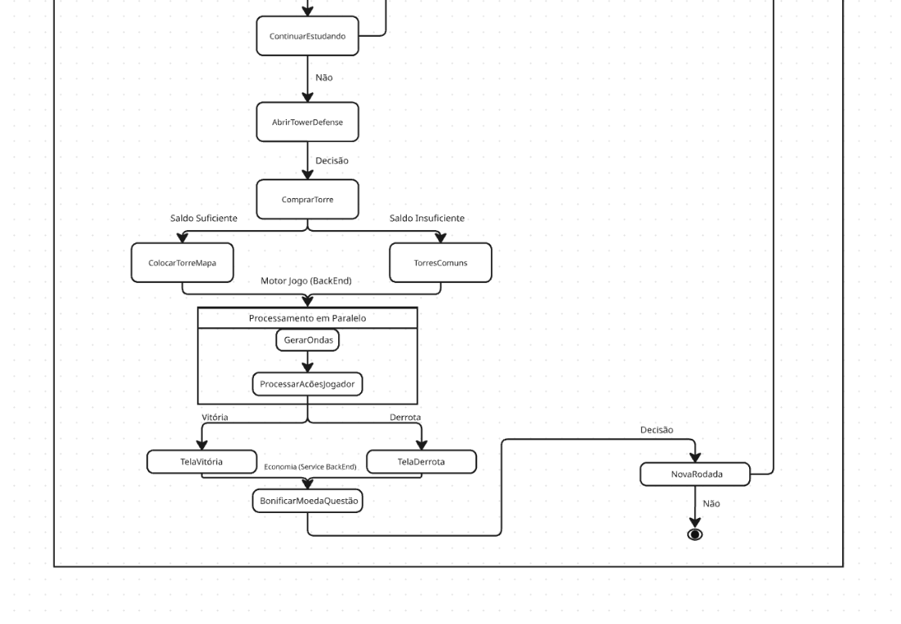

### Senso Crítico

- **Relação com o BPMN (Entrega 01):** o BPMN era *orientado ao processo de negócio* (papéis do estudante, professor e admin). Este diagrama é *orientado ao software* — foca apenas nas atividades que o sistema observa/executa. Essa tradução intencional é o que justifica sua existência na Entrega 02.
- **Escolha de escopo:** modelamos o loop *macro*, não a mecânica interna de cada partida de TD. Detalhar a partida inflaria o diagrama e duplicaria a Máquina de Estados da `Partida` (§2.2.4).

### Comprobatórios de Participação (Diagrama de Atividades)

| Membro         | Comentário / evidência                                                                                    |
| -------------- | --------------------------------------------------------------------------------------------------------- |
| Ana Elisa      | 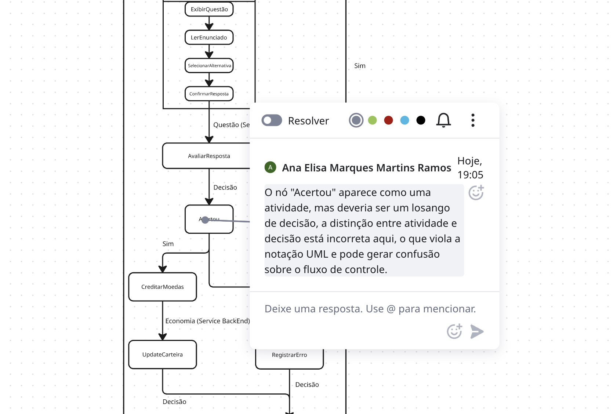                      |
| Dannyeclisson  | 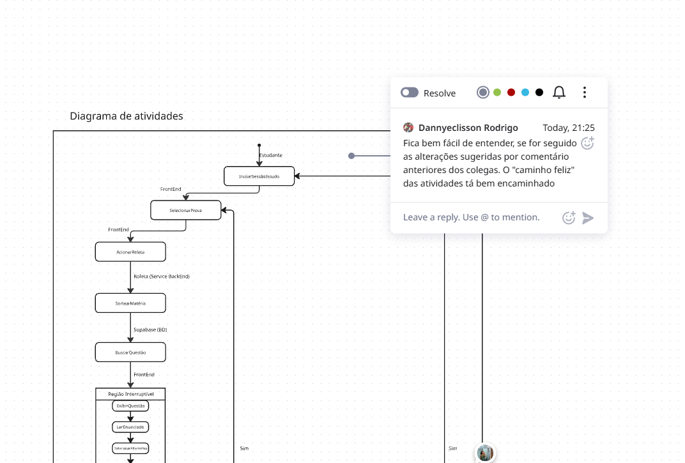           |
| Eric Akio      | 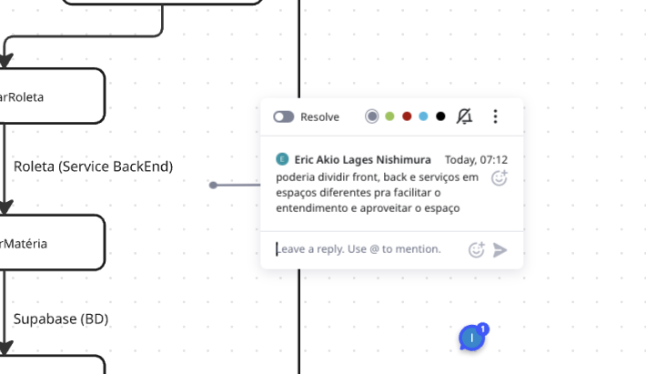                    |
| João Lobo      | 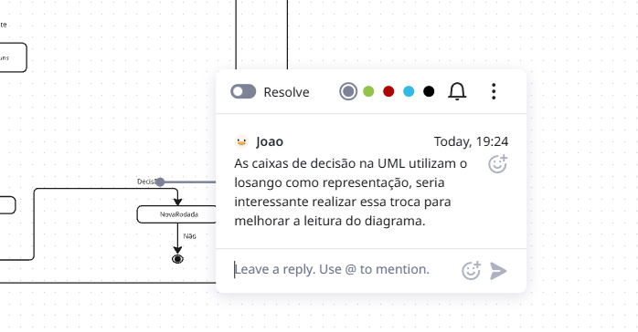           |
| João Sapiência | 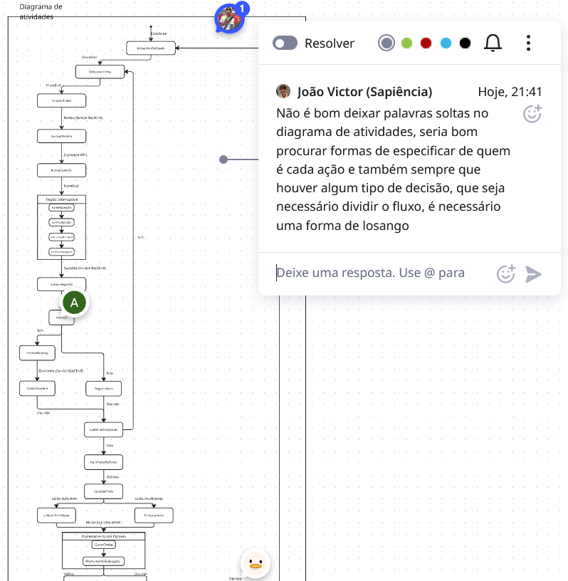 |
| Lucas Oliveira | 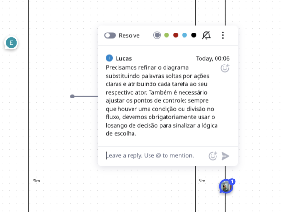                  |
| Marina         | 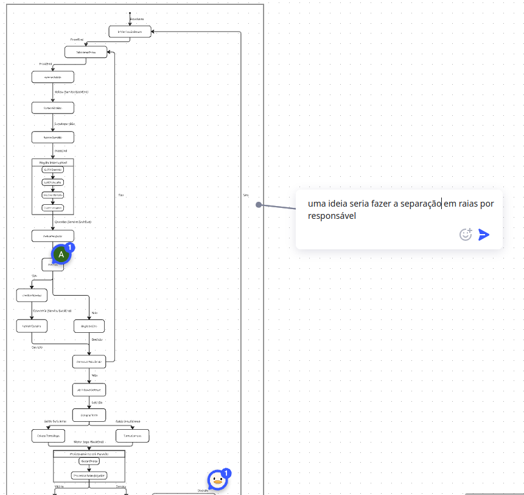                |

---

## 2.2.3. Diagrama de Comunicação

### Definição

O **Diagrama de Comunicação** (antes chamado *Diagrama de Colaboração*) expressa a mesma informação de um Diagrama de Sequência — *quem chama quem com qual mensagem* — mas organizado espacialmente ao redor dos objetos, com mensagens numeradas para indicar ordem (Larman, 2004). Ele privilegia a **topologia** das interações em detrimento da **cronologia**, sendo útil para detectar objetos *hub* (muitas conexões) ou *acoplamento indevido*.

### Aplicação no Battle Class — "Responder Questão"

Construído sobre o **mesmo cenário** do Diagrama de Sequência, permite o *cross-check* mencionado na metodologia: se uma mensagem existe em um diagrama e não no outro, há inconsistência de modelagem.

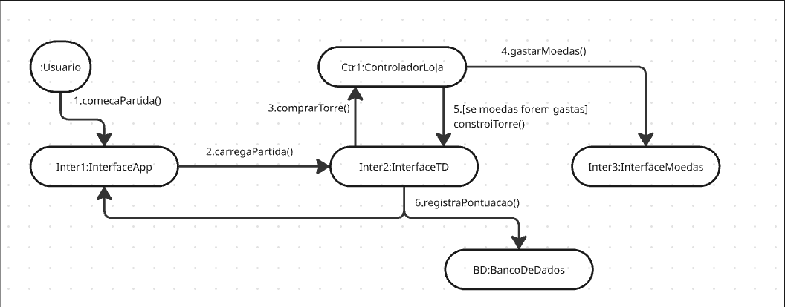

> Versão inicial: [`Eric_Akio_DiagramaComunicacao1.png`](../assets/diagramas/estatica/Eric_Akio_DiagramaComunicacao1.png) — mantida para rastreabilidade.

### Senso Crítico

- **V1 → V2:** a primeira versão tinha o `Front-end` chamando diretamente o `BancoDeQuestoes` — a V2 corrige para passar pelo `MotorRoleta`, respeitando a fronteira de componentes do §2.1.2. Inconsistência detectada *justamente* pelo cruzamento com o Diagrama de Sequência.
- **Complementariedade com Sequência:** o Diagrama de Comunicação deixou visível que `SistemaEconomia` é um *hub* (é invocado tanto pelo fluxo de crédito por acerto quanto pelo saque para o TD) — um ponto de atenção para futura instrumentação de métricas.

### Comprobatórios de Participação (Diagrama de Comunicação)

| Membro         | Comentário / evidência                                                                                      |
| -------------- | ----------------------------------------------------------------------------------------------------------- |
| Ana Elisa      | 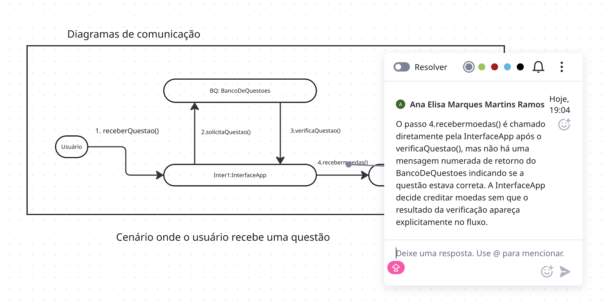                      |
| Dannyeclisson  | 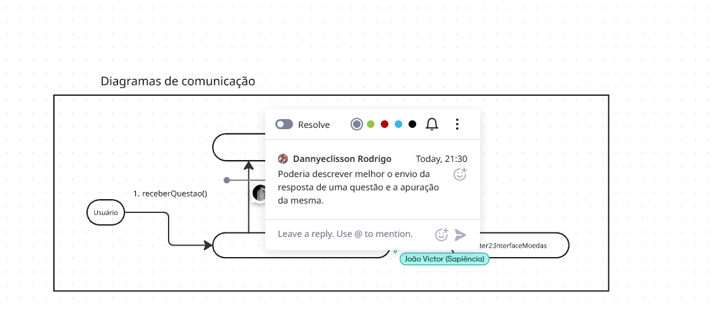           |
| João Sapiência | 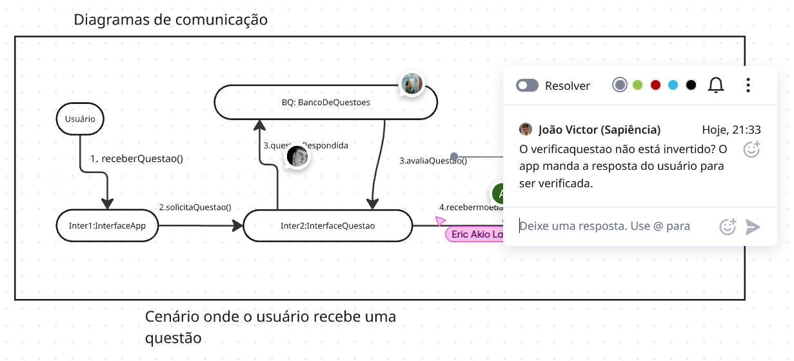 |
| Marina         | 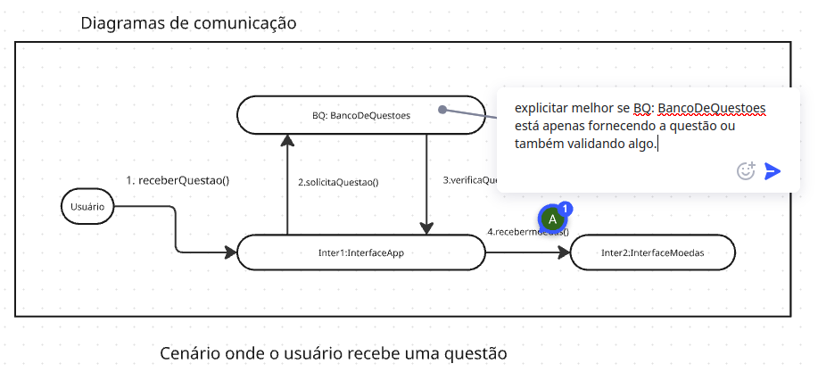                |
| Thiago         | 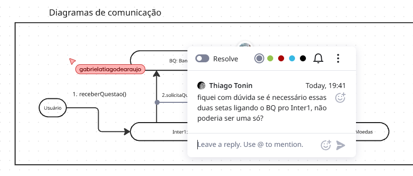                          |

---

## 2.2.4. Diagrama de Máquina de Estados

### Definição

Introduzida por **David Harel (1987)** como *statecharts* e incorporada à UML, uma **Máquina de Estados** é uma tripla $M = (S, T, s_0)$ com conjunto finito de estados $S$, transições $T \subseteq S \times E \times S$ (cada transição rotulada por um evento $e \in E$ com guarda e ação opcionais) e estado inicial $s_0$. Permite modelar objetos *reativos* — aqueles cujo comportamento depende não só da entrada atual, mas do histórico acumulado.

### Aplicação no Battle Class — Máquina de Estados da `Partida`

A classe `Partida` do domínio é reativa por definição: seu comportamento depende do *estado* (em preparação, ativa, pausada, vencida, derrotada) e das transições disparadas por eventos do jogador e do motor de ondas.

**Estados modelados:**
- `Preparacao` — estado inicial; jogador monta o *loadout* com `MoedaQuestao` da carteira.
- `Ativa` — partida rodando; ondas chegam, `MoedaOuroPartida` é gerada/gasta.
- `Pausada` — pausa explícita do jogador; relógio das ondas congela.
- `Vitoria` — todas as ondas derrotadas; concede bônus.
- `Derrota` — base invadida; partida termina sem bônus.

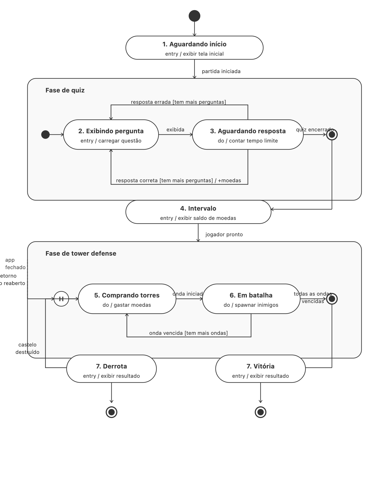

> Versão inicial: [`DiagramaMaquinaDeEstados-V1.png`](../assets/diagramas/estatica/DiagramaMaquinaDeEstados-V1.png).

### Senso Crítico

- **V1 → V2:** a V1 tratava `Vitoria` e `Derrota` como o mesmo estado "Encerrada". Separá-los na V2 torna explícito que só a transição para `Vitoria` dispara a ação *conceder bônus*, reduzindo ambiguidade na implementação do `MotorTowerDefense`.
- **`MoedaOuroPartida` só varia em `Ativa`:** a máquina torna visível que em `Pausada` não há ganho/gasto — regra invisível no Diagrama de Classes isoladamente.

### Comprobatórios de Participação (Diagrama de Máquina de Estados)

| Membro         | Comentário / evidência                                                                                      |
| -------------- | ----------------------------------------------------------------------------------------------------------- |
| Dannyeclisson  | 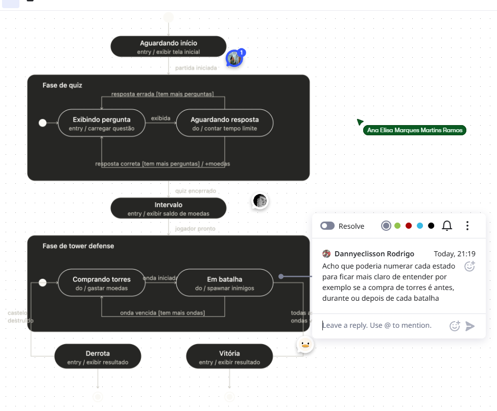           |
| João Sapiência | 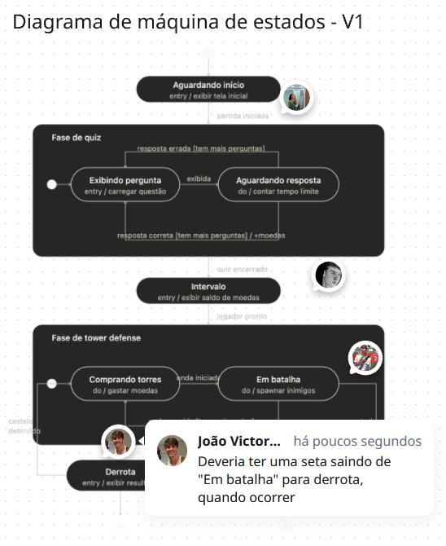 |
| Lucas Oliveira | 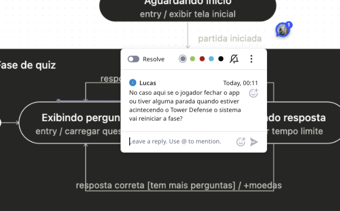                 |
| Marina         | 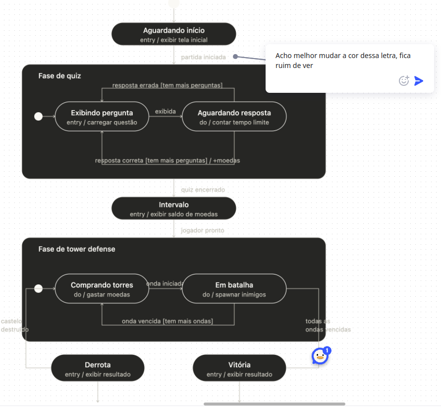                |
| Thiago         | 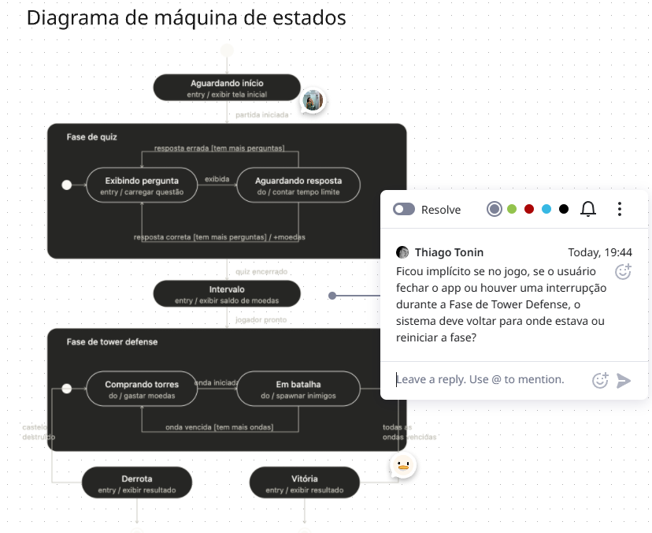                         |

---

## Rastreabilidade e Elos com Outros Artefatos

- **Design Sprint, Perguntas 6 e 9** → a exigência de feedback pós-erro virou atividade *"Exibir explicação"* (§2.2.2) e a decisão de moeda consumível dentro da partida virou a restrição de que `MoedaOuroPartida` só existe no estado `Ativa` (§2.2.4).
- **BPMN (Entrega 01, §1.3)** → cada *pool* do BPMN tem um diagrama equivalente aqui: "estudar" ↔ Sequência "Responder Questão"; "jogar" ↔ Máquina de Estados da Partida.
- **[2.1. UML Estática](/Modelagem/2.1.ModelagemEstatica.md)** → cada *lifeline* dos diagramas de Sequência e objeto dos diagramas de Comunicação corresponde a um componente do §2.1.2.
- **[2.3. UML Organizacional](/Modelagem/2.3.ModelagemOrganizacionalCasosDeUso.md)** → cada cenário aqui modelado é o *corpo* de um caso de uso apresentado no Foco 3 (ex.: "Responder Questão", "Jogar Partida").

## Senso Crítico Geral

O grande aprendizado do Foco 2 foi o valor de **modelar o mesmo cenário em diagramas diferentes**: o giro V1→V2 do Diagrama de Comunicação só aconteceu porque o Diagrama de Sequência já mostrava o caminho certo. Se tivéssemos modelado cenários distintos em cada diagrama, o erro teria passado despercebido.

A limitação honesta é que os quatro diagramas cobrem bem o **fluxo feliz**. Fluxos de erro (questão inválida, perda de conexão no meio de uma partida) foram reconhecidos mas não modelados, porque inflar a modelagem com todos os cenários de falha é contraprodutivo em nível acadêmico — pertence à fase de design de resiliência.

## Histórico de Versões

| Versão | Data       | Descrição                                             | Autor(es)                                                                                | Revisor(es) |
| ------ | ---------- | ----------------------------------------------------- | ---------------------------------------------------------------------------------------- | ----------- |
| 1.0    | 24/04/2026 | Versões V2 dos 4 diagramas dinâmicos + comprobatórios | João Lobo, João Sapiência, Marina, Eric Akio, Ana Elisa, Dannyeclisson, Thiago, Gabriela | Equipe G6   |

## Referências

- OBJECT MANAGEMENT GROUP (OMG). **OMG Unified Modeling Language (UML) — Version 2.5.1**. 2017.
- BOOCH, G.; RUMBAUGH, J.; JACOBSON, I. **The Unified Modeling Language User Guide**. 2. ed. Addison-Wesley, 2005.
- FOWLER, M. **UML Distilled**. 3. ed. Addison-Wesley, 2003.
- LARMAN, C. **Applying UML and Patterns**. 3. ed. Prentice Hall, 2004.
- HAREL, D. **Statecharts: A Visual Formalism for Complex Systems**. Science of Computer Programming, v. 8, n. 3, p. 231–274, 1987.
