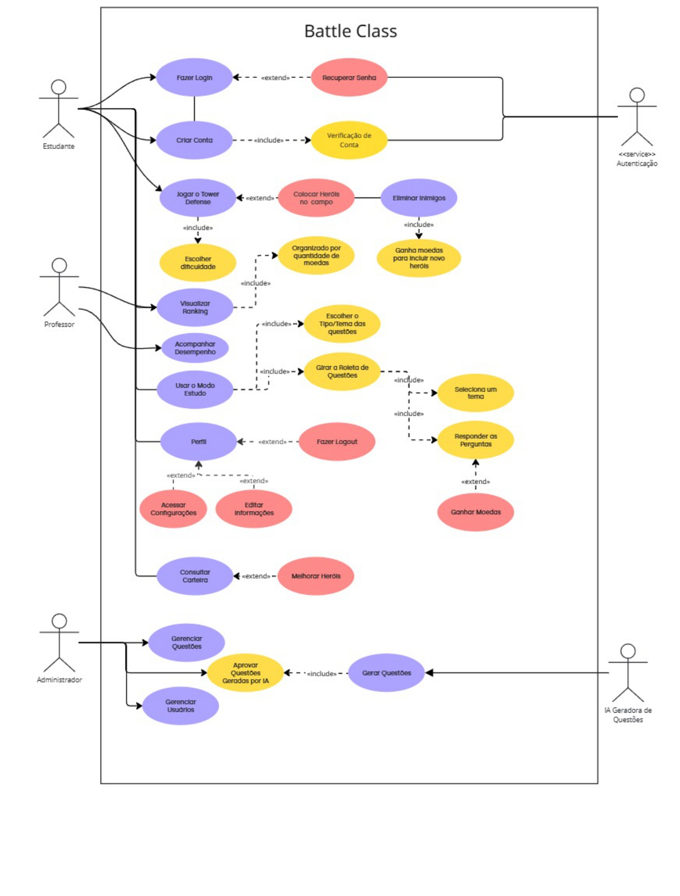
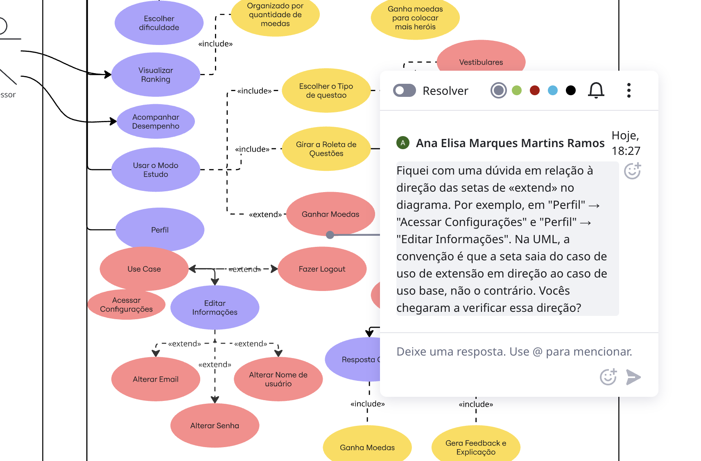
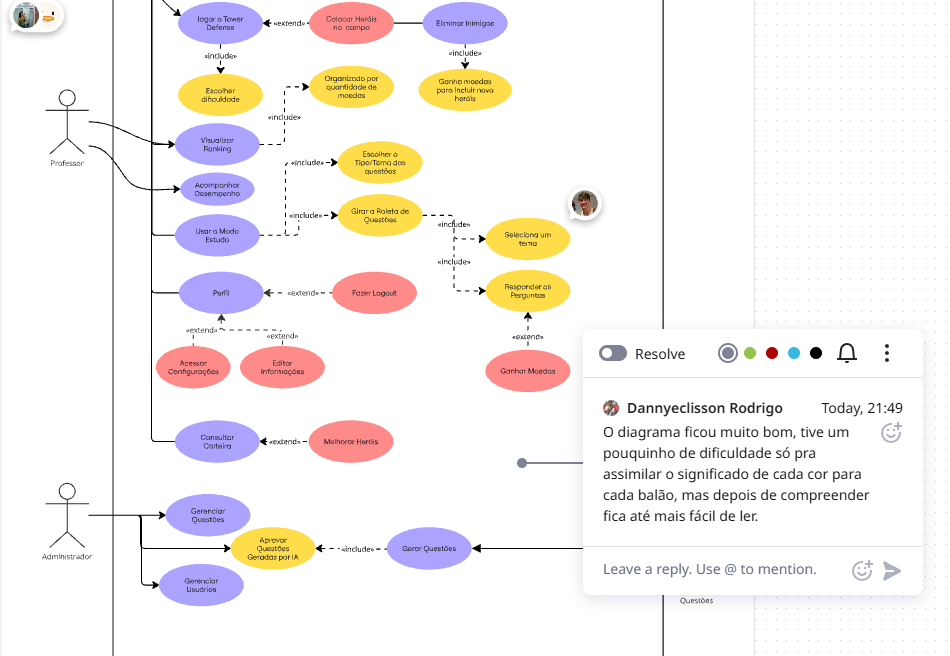
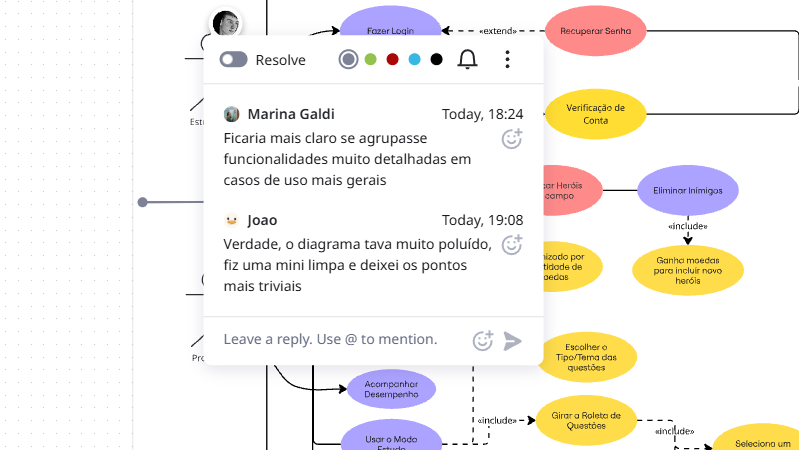
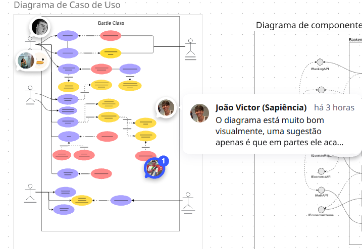
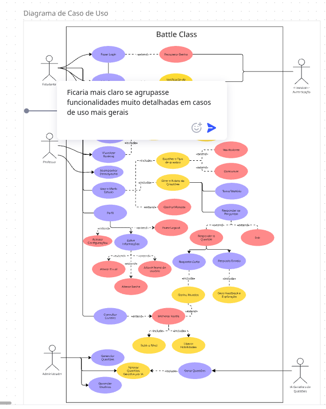
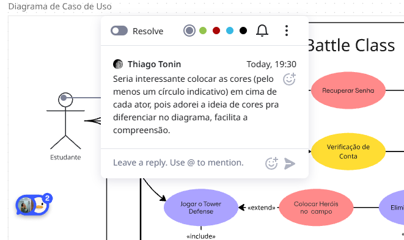

# 2.3. UML Organizacional / Casos de Uso

## Introdução

A modelagem **organizacional / de uso** responde a duas perguntas estruturais complementares: *"como o sistema se organiza internamente?"* (via **Diagrama de Pacotes**) e *"o que ele oferece aos atores externos?"* (via **Diagrama de Casos de Uso**). Os dois diagramas operam em níveis opostos: Pacotes enxerga o sistema *de dentro*, como código; Casos de Uso enxerga *de fora*, como serviço.

| Diagrama | Ponto de vista | Pergunta que responde |
|---|---|---|
| **Pacotes** | Interno (código/arquitetura) | *Como as classes se agrupam em módulos coesos?* |
| **Casos de Uso** | Externo (atores) | *Que objetivos o usuário alcança usando o sistema?* |

Juntos, eles fecham o ciclo da modelagem: Pacotes materializa as decisões de composição apresentadas em [2.1. UML Estática](/Modelagem/2.1.ModelagemEstatica.md), e Casos de Uso fornece o *contexto* que amarra cada cenário comportamental descrito em [2.2. UML Dinâmica](/Modelagem/2.2.ModelagemDinamica.md).

## Metodologia

- **Fontes primárias:** Design Sprint (Entrega 01), levantamento de atores do BPMN e loop principal do jogo.
- **Ferramentas:** draw.io (casos de uso e pacotes).
- **Autoria e revisão:** cada diagrama teve um *owner* (individual ou dupla) que produziu a versão inicial; os demais membros comentaram o artefato (ver *Comprobatórios de Participação* abaixo) e o *owner* consolidou a versão final. Para o Diagrama de Casos de Uso, apenas o estado final foi preservado — os comentários individuais sobre ele estão registrados abaixo.
- **Processo:** o Diagrama de Casos de Uso foi construído a partir das 24 perguntas do Unpack da Design Sprint, destilando **ações finalísticas** (o que o ator *quer alcançar*) de **ações acessórias** (o que ele *apenas executa*).

---

## 2.3.1. Diagrama de Casos de Uso

### Definição

Um **Diagrama de Casos de Uso** modela a interação entre **atores** (agentes externos ao sistema — humanos ou outros sistemas) e **casos de uso** (unidades coerentes de funcionalidade que entregam valor ao ator) (Cockburn, 2000; Jacobson, Booch & Rumbaugh, 1999). Formalmente, é uma bipartição $B = (A \cup U, R)$, onde $A$ é o conjunto de atores, $U$ o de casos de uso e $R$ as relações de *associação*, *include* (⟨include⟩: um caso sempre invoca o outro), *extend* (⟨extend⟩: extensão opcional) e *generalização*.

### Aplicação no Battle Class

Identificamos **três atores humanos** e um **ator sistema externo**:

| Ator | Papel |
|---|---|
| **Estudante** | Usuário final — responde questões, joga TD, consulta ranking |
| **Professor** | Autor/curador de questões e revisor de gabarito |
| **Admin** | Gestão de usuários, bancas e configurações da plataforma |
| **Supabase Auth** | Sistema externo responsável por emissão/validação de token |

**Casos de uso principais (visão agrupada):**

- **Autenticação:** `Cadastrar-se`, `Fazer Login`, `Recuperar Senha` ← *todos* ⟨include⟩ `Validar Token` (Supabase Auth)
- **Estudo:** `Selecionar Prova/Disciplina`, `Girar Roleta` ⟨include⟩ `Responder Questão` ⟨extend⟩ `Ver Explicação do Erro`
- **Economia & Ranking:** `Consultar Carteira`, `Consultar Ranking`
- **Tower Defense:** `Montar Loadout` ⟨include⟩ `Jogar Partida` ⟨extend⟩ `Comprar Power-up`
- **Curadoria (Professor):** `Cadastrar Questão`, `Editar Questão`, `Revisar Gabarito`
- **Gestão (Admin):** `Gerenciar Usuários`, `Gerenciar Bancas`, `Publicar Banner`

### Senso Crítico

- **Relações ⟨include⟩ e ⟨extend⟩ aplicadas com parcimônia:** só usamos ⟨include⟩ quando o sub-caso é *obrigatório* em todas as execuções do caso-pai (ex.: `Validar Token` sempre ocorre num login). Evitamos o *anti-padrão* de decompor todo fluxo em ⟨include⟩, o que tornaria o diagrama ilegível (Cockburn, 2000).
- **Ator "Supabase Auth" explícito:** colocá-lo como ator deixa claro que validação de identidade é *serviço externo*, não parte do núcleo do Battle Class — coerente com o Diagrama de Componentes do §2.1.2.
- **Papéis de `Professor` e `Admin` são de *backoffice* e foram escopados fora do MVP da Design Sprint**, mas permanecem no diagrama porque são casos de uso *arquiteturalmente significativos* (impõem controle de acesso, dividem o front-end em áreas).
- **Limitação:** não modelamos os fluxos alternativos (ex.: "login falhou por 3 tentativas") — eles pertencem às **descrições textuais** de caso de uso (estilo Cockburn), previstas para a entrega seguinte.

### Comprobatórios de Participação (Diagrama de Casos de Uso)

| Membro | Comentário / evidência |
|---|---|
| Ana Elisa |  |
| Dannyeclisson |  |
| João Lobo |  |
| João Sapiência |  |
| Marina |  |
| Thiago |  |

---

## 2.3.2. Diagrama de Pacotes

### Definição

Um **Diagrama de Pacotes** agrupa elementos do modelo (classes, componentes, *use cases*) em **pacotes** — espaços de nome que estabelecem dependências unidirecionais entre si (Booch et al., 2005). Um bom pacote tem **alta coesão interna** (todas as classes respondem a uma mesma razão de mudança) e **baixo acoplamento externo** (dependências minimizadas), conforme o princípio *Common Closure* de Robert C. Martin (2003).

### Aplicação no Battle Class

A organização em pacotes espelha os agregados de domínio do Diagrama de Classes (§2.1.1), reagrupados por afinidade arquitetural:

| Pacote | Conteúdo principal | Depende de |
|---|---|---|
| `identidade` | `Usuario`, `Estudante`, `Professor`, `Admin` | — |
| `conhecimento` | `Taxonomia`, `Questao`, `Alternativa` | `identidade` (autoria) |
| `economia` | `Carteira`, `MoedaQuestao` | `identidade` |
| `partida` | `Partida`, `Onda`, `Heroi`, `Torre`, `Mapa`, `MoedaOuroPartida` | `economia` |
| `ranking` | `Ranking`, `Pontuacao` | `economia`, `partida` |
| `ui` | Telas React | *todos os anteriores via API REST* |
| `infra` | *Adapters* para Supabase Auth e Supabase DB | — (pacote de fronteira) |

> A *regra de dependência* é sempre de cima para baixo: `ui` depende dos pacotes de domínio; os pacotes de domínio dependem apenas de `infra` via interfaces; `identidade` é raiz e não depende de nenhum outro.

### Senso Crítico

- **Por que separar `partida` e `economia`?** Apesar de `MoedaOuroPartida` ser usada *dentro* da partida, seu **ciclo de vida é diferente** de `MoedaQuestao`. Manter em pacotes distintos explicita essa fronteira e impede que a persistência de moeda-de-partida "vaze" para a carteira permanente.
- **`infra` não é domínio:** colocá-lo como pacote à parte é consequência direta da *Dependency Inversion*: o domínio só conhece interfaces que `infra` implementa — útil para testar o domínio sem Supabase.
- **`ui` no topo:** o pacote de UI depende de todos, mas ninguém depende dele. Isso é exatamente o que esperamos de um *front-end*: plugável, substituível.

---

## Rastreabilidade e Elos com Outros Artefatos

- **Design Sprint, Pergunta 23** ("funcionalidades essenciais do MVP") → os itens marcados pela maioria viraram casos de uso principais; os "legal ter depois" ficaram fora do diagrama de casos de uso desta entrega.
- **[2.1. UML Estática §2.1.1](/Modelagem/2.1.ModelagemEstatica.md#_211-diagrama-de-classes)** → cada classe do Diagrama de Classes vive em exatamente um pacote do §2.3.2. Essa bijeção é garantia de consistência entre os dois focos.
- **[2.2. UML Dinâmica](/Modelagem/2.2.ModelagemDinamica.md)** → cada caso de uso tem pelo menos um diagrama comportamental que detalha seu corpo: `Responder Questão` → Sequência + Comunicação; `Jogar Partida` → Máquina de Estados da Partida.
- **Protótipo de Alta Fidelidade** → cada tela do protótipo corresponde a um caso de uso.

## Senso Crítico Geral

O Foco 3 tem uma característica peculiar: ele **não introduz fatos novos sobre o sistema** — todas as informações já aparecem, dispersas, nos Focos 1 e 2. O valor está em **reagrupar** essas informações pela *lente de quem vê o sistema de fora* (atores) e pela *lente de quem o mantém no código* (pacotes). Essa reagrupação é o que sustenta decisões de produto (priorização de casos de uso para próximas entregas) e de arquitetura (qual pacote isolar quando o sistema crescer).

Limitação explícita: não produzimos **descrições textuais** caso-a-caso no formato Cockburn (ator principal, pré-condição, fluxo principal, fluxos alternativos, pós-condição). Isso fica previsto para a entrega seguinte, onde será casado com rastreio de requisitos.

## Histórico de Versões

| Versão | Data | Descrição | Autor(es) | Revisor(es) |
|---|---|---|---|---|
| 1.0 | 24/04/2026 | Diagrama de Casos de Uso consolidado + organização em pacotes | João Lobo, João Sapiência, Marina, Otávio | Equipe G6 |

## Referências

- OBJECT MANAGEMENT GROUP (OMG). **OMG Unified Modeling Language (UML) — Version 2.5.1**. 2017.
- JACOBSON, Ivar; BOOCH, Grady; RUMBAUGH, James. **The Unified Software Development Process**. Addison-Wesley, 1999.
- COCKBURN, Alistair. **Writing Effective Use Cases**. Addison-Wesley, 2000.
- BOOCH, G.; RUMBAUGH, J.; JACOBSON, I. **The Unified Modeling Language User Guide**. 2. ed. Addison-Wesley, 2005.
- MARTIN, Robert C. **Agile Software Development: Principles, Patterns, and Practices**. Prentice Hall, 2003. (Princípios SOLID e Common Closure.)
- LARMAN, C. **Applying UML and Patterns**. 3. ed. Prentice Hall, 2004.
