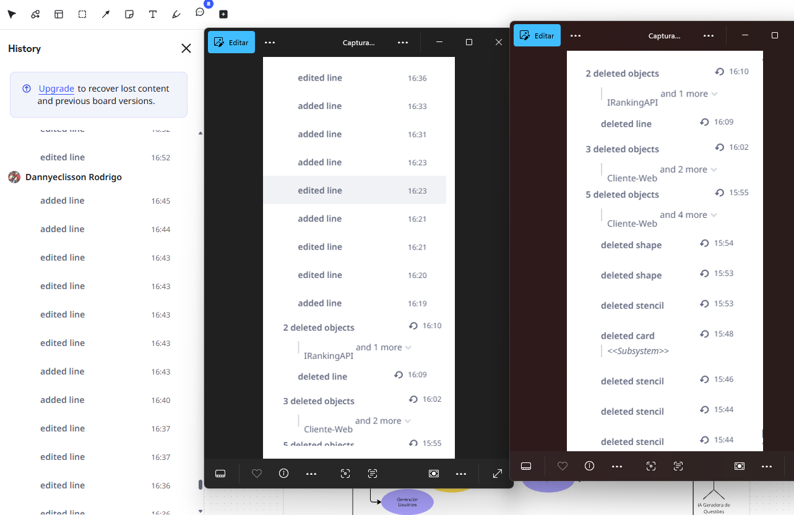
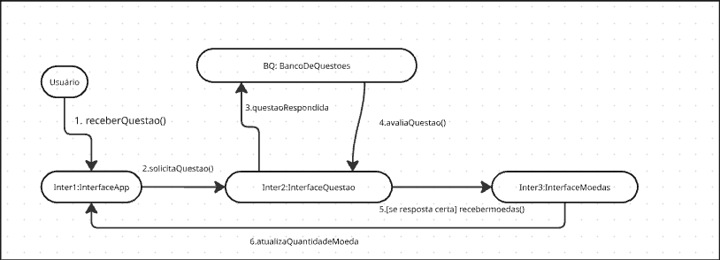
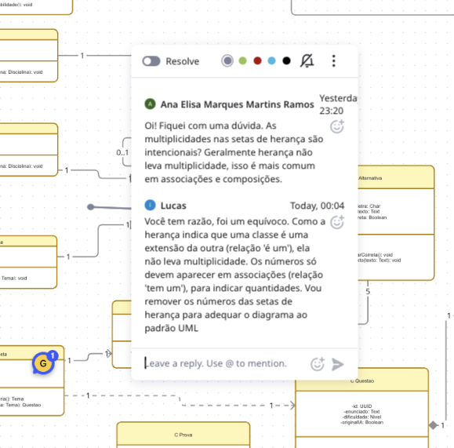
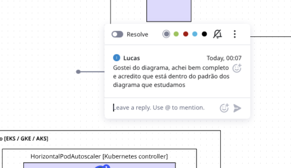
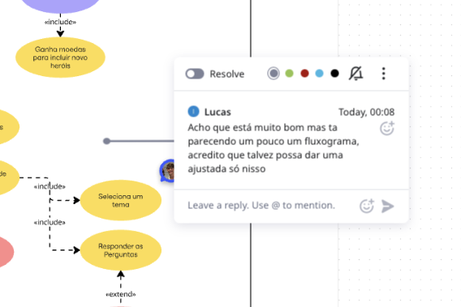
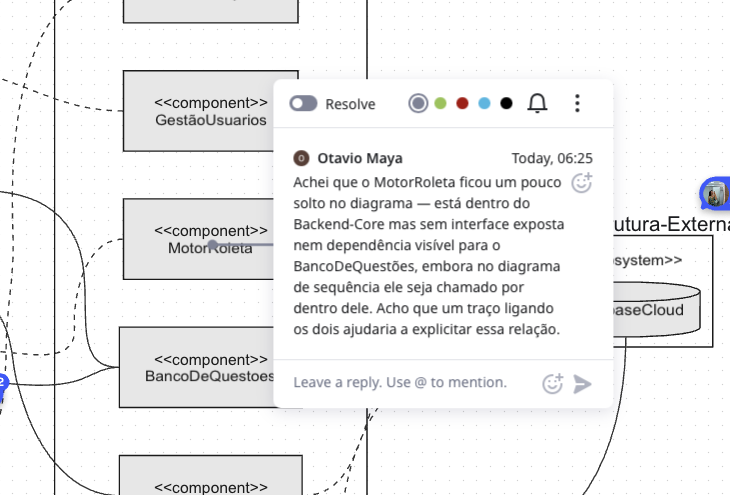
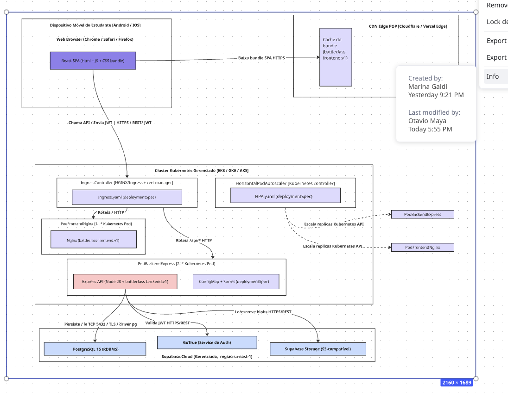
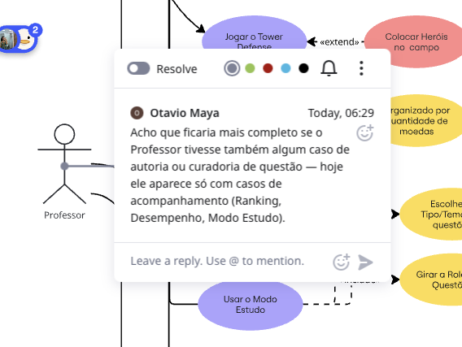
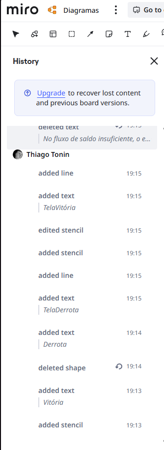

# 2.4. Participações (Modelagem)

Este capítulo consolida as contribuições individuais dos membros do Grupo 6 à **Entrega 02**, em duas visões complementares:

1. **Sumário por Foco** — três tabelas (uma por foco) com contribuição principal, significância e links aos comprobatórios.
2. **Galeria por Membro** — uma seção por integrante exibindo, em imagens inline, cada comprobatório enviado (comentário anotado sobre o diagrama revisado).

**Classificação adotada:** *Excelente · Boa · Regular · Ruim · Nula*.

> 💡 **Dica de navegação.** Clique no nome de qualquer membro nas tabelas abaixo para saltar direto à sua galeria de comprobatórios.
> Os arquivos originais estão em [`docs/assets/comprovatorios/<Membro>/`](../assets/comprovatorios/).

---

## Foco 1 — Modelagem Estática
*Classes, Componentes, Implantação*

| Membro | Contribuição | Significância | Comprobatórios |
|---|---|---|---|
| [**Ana Elisa Ramos**](/Modelagem/2.4.ParticipacoesModelagem?id=ana-elisa) | Revisão dos três diagramas estáticos (Classes, Componentes, Implantação) com comentários pontuais de consistência. | Excelente | [Classes](../assets/comprovatorios/Ana/ComentatioDiagramaDeClasses.png) · [Componentes](../assets/comprovatorios/Ana/ComentarioDiagramaDeComponentes.png) · [Implantação](../assets/comprovatorios/Ana/ComentarioDiagramaDeImplantacao.png) |
| [**Dannyeclisson Costa**](/Modelagem/2.4.ParticipacoesModelagem?id=dannyeclisson) | Revisão do Diagrama de Implantação e histórico de participação no Miro. | Boa | [Implantação](../assets/comprovatorios/Dannyeclisson/ComentarioDiagramaDeImplantacao.png) · [Histórico Miro](../assets/comprovatorios/Dannyeclisson/HistoricomiroDiagrama.png) |
| [**Eric Akio Nishimura**](/Modelagem/2.4.ParticipacoesModelagem?id=eric-akio) | Participação síncrona nas reuniões de consolidação; foco autoral no Foco 2 (Comunicação). | Regular | ver Foco 2 |
| [**Gabriela Tiago de Araújo**](/Modelagem/2.4.ParticipacoesModelagem?id=gabriela) | Revisão do Diagrama de Classes com sugestão de tratar a `Roleta` como serviço de domínio. | Boa | [Classes](../assets/comprovatorios/Gabriela/ComentarioDiagramaDeClasses.png) |
| [**João Carlos Lobo**](/Modelagem/2.4.ParticipacoesModelagem?id=joao-lobo) | Debates de arquitetura e definição dos 8 componentes de back-end. | Boa | participação síncrona (ver commits do repositório) |
| [**João Victor Sapiência**](/Modelagem/2.4.ParticipacoesModelagem?id=joao-sapiencia) | Revisão dos Diagramas de Componentes e Implantação com sugestões incorporadas na V2. | Excelente | [Componentes](../assets/comprovatorios/JoaoSapiencia/ComentarioDiagramaDeComponentes.png) · [Implantação](../assets/comprovatorios/JoaoSapiencia/ComentarioDiagramaDeImplantacao.png) |
| [**Lucas Oliveira D. M. Ferreira**](/Modelagem/2.4.ParticipacoesModelagem?id=lucas) | **Autor** do Diagrama de Classes (completo, com quatro quadrantes recortados para leitura); revisão do Diagrama de Implantação. | Excelente | [Classes (autoria + resposta à Ana)](../assets/comprovatorios/Lucas/ComentarioDiagramaDeClasse.png) · [Implantação](../assets/comprovatorios/Lucas/ComentarioDiagramaDeImplantacao.png) |
| [**Marina Agostini Galdi**](/Modelagem/2.4.ParticipacoesModelagem?id=marina) | Revisão do Diagrama de Componentes; contribuiu para a separação entre `SistemaEconomia` e `MotorTowerDefense`. | Boa | [Componentes](../assets/comprovatorios/Marina/ComentarioDiagramaDeComponentes.png) |
| [**Otávio Maya**](/Modelagem/2.4.ParticipacoesModelagem?id=otavio) | Consolidação da página de UML Estática na wiki (Classes, Componentes, Implantação); revisão do Diagrama de Componentes apontando o `MotorRoleta` sem interface exposta; edições no Diagrama de Implantação. | Excelente | [Componentes](../assets/comprovatorios/Otavio/ComprobatorioDiagramaDeComponentes.png) · [Implantação (histórico)](../assets/comprovatorios/Otavio/ComprobatorioDiagramaDeImplantacao.png) |
| [**Thiago Tonin**](/Modelagem/2.4.ParticipacoesModelagem?id=thiago) | Revisão dos Diagramas de Componentes e Implantação. | Boa | [Componentes](../assets/comprovatorios/Thiago/ComentarioComponentes.PNG) · [Implantação](../assets/comprovatorios/Thiago/ComentarioImplantacao.PNG) |

---

## Foco 2 — Modelagem Dinâmica
*Sequência, Atividades, Comunicação, Máquina de Estados*

| Membro | Contribuição | Significância | Comprobatórios |
|---|---|---|---|
| [**Ana Elisa Ramos**](/Modelagem/2.4.ParticipacoesModelagem?id=ana-elisa) | Revisão dos Diagramas de Sequência, Atividades e Comunicação. | Excelente | [Sequência](../assets/comprovatorios/Ana/ComentarioDiagramaDeSequencia.png) · [Atividades](../assets/comprovatorios/Ana/ComentarioDiagramaDeAtividades.png) · [Comunicação](../assets/comprovatorios/Ana/ComentarioDiagramaDeComunicacao.png) |
| [**Dannyeclisson Costa**](/Modelagem/2.4.ParticipacoesModelagem?id=dannyeclisson) | Revisão dos quatro diagramas dinâmicos. | Excelente | [Sequência](../assets/comprovatorios/Dannyeclisson/ComentarioDiagramaDeSequencia.png) · [Atividades](../assets/comprovatorios/Dannyeclisson/ComentarioDiagramaDeAtividades.png) · [Comunicação](../assets/comprovatorios/Dannyeclisson/ComentarioDiagramaDeComunicacao.png) · [Estados](../assets/comprovatorios/Dannyeclisson/ComentarioDiagramaDeMaquinaDeEstado.png) |
| [**Eric Akio Nishimura**](/Modelagem/2.4.ParticipacoesModelagem?id=eric-akio) | **Autor** das duas versões (V1/V2) do Diagrama de Comunicação; revisão do Diagrama de Atividades sugerindo dividir o fluxo em espaços separados por camada (front, back, serviços) para melhor leitura. | Excelente | [Comunicação V1](../assets/diagramas/estatica/Eric_Akio_DiagramaComunicacao1.png) · [Comunicação V2](../assets/diagramas/estatica/Eric_Akio_DiagramaComunicacao2.png) · [Atividades](../assets/comprovatorios/Eric/ComentarioDiagramaDeAtividades.png) |
| [**Gabriela Tiago de Araújo**](/Modelagem/2.4.ParticipacoesModelagem?id=gabriela) | Revisão do Diagrama de Sequência com sugestão de padronização dos nomes de mensagens (`success`, `true`, `false`) para consistência semântica. | Boa | [Sequência](../assets/comprovatorios/Gabriela/ComentarioDiagramaDeSequencia.png) |
| [**João Carlos Lobo**](/Modelagem/2.4.ParticipacoesModelagem?id=joao-lobo) | Revisão dos Diagramas de Sequência (dois comentários) e Atividades. | Excelente | [Atividades](../assets/comprovatorios/JoaoLobo/ComentarioDiagramaDeAtividades.png) · [Sequência 1](../assets/comprovatorios/JoaoLobo/ComentarioDiagramaDeSequencia.png) · [Sequência 2](../assets/comprovatorios/JoaoLobo/ComentarioDiagramaDeSequencia2.png) |
| [**João Victor Sapiência**](/Modelagem/2.4.ParticipacoesModelagem?id=joao-sapiencia) | Revisão dos Diagramas de Atividades, Comunicação e Máquina de Estados. | Excelente | [Atividades](../assets/comprovatorios/JoaoSapiencia/ComentarioDiagramaDeAtividades.png) · [Comunicação](../assets/comprovatorios/JoaoSapiencia/ComentarioDiagramaDeComunicacao.png) · [Estados](../assets/comprovatorios/JoaoSapiencia/ComentarioDiagramaDeMaquinaDeEstado.png) |
| [**Lucas Oliveira D. M. Ferreira**](/Modelagem/2.4.ParticipacoesModelagem?id=lucas) | Revisão dos Diagramas de Sequência, Atividades e Máquina de Estados; levantou a questão de o que acontece com a Partida se o app for fechado no meio do TD. | Excelente | [Sequência](../assets/comprovatorios/Lucas/ComentarioDiagramaDeSequencia.png) · [Atividades](../assets/comprovatorios/Lucas/ComentarioDiagramaDeAtividades.png) · [Estados](../assets/comprovatorios/Lucas/ComentarioDiagramaDeMaquinaDeEstados.png) |
| [**Marina Agostini Galdi**](/Modelagem/2.4.ParticipacoesModelagem?id=marina) | Revisão dos quatro diagramas dinâmicos; sugeriu a separação `Vitoria` / `Derrota` na Máquina de Estados. | Excelente | [Sequência](../assets/comprovatorios/Marina/ComentarioDiagramaDeSequencia.png) · [Atividades](../assets/comprovatorios/Marina/ComentarioDiagramaDeAtividades.png) · [Comunicação](../assets/comprovatorios/Marina/ComentarioDiagramaDeComunicacao.png) · [Estados](../assets/comprovatorios/Marina/ComentarioDiagramaDeMaquinaDeEstado.png) · [Histórico Miro](../assets/comprovatorios/Marina/HistoricomiroDiagrama.png) |
| [**Otávio Maya**](/Modelagem/2.4.ParticipacoesModelagem?id=otavio) | Consolidação da página de UML Dinâmica na wiki (Sequência, Atividades, Comunicação, Máquina de Estados), incluindo organização dos comprobatórios e redação das seções de Senso Crítico e Rastreabilidade. | Excelente | ver histórico de commits do repositório |
| [**Thiago Tonin**](/Modelagem/2.4.ParticipacoesModelagem?id=thiago) | Revisão dos Diagramas de Sequência, Comunicação e Máquina de Estados. | Excelente | [Sequência](../assets/comprovatorios/Thiago/ComentarioSequencia.PNG) · [Comunicação](../assets/comprovatorios/Thiago/ComentarioComunicacao.PNG) · [Estados](../assets/comprovatorios/Thiago/ComentarioMaquinadeEstados.PNG) · [Histórico Miro](../assets/comprovatorios/Thiago/HistoricoMiroThiago.PNG) |

---

## Foco 3 — Modelagem Organizacional / Casos de Uso
*Pacotes, Casos de Uso*

| Membro | Contribuição | Significância | Comprobatórios |
|---|---|---|---|
| [**Ana Elisa Ramos**](/Modelagem/2.4.ParticipacoesModelagem?id=ana-elisa) | Revisão do Diagrama de Casos de Uso. | Boa | [Casos de Uso](../assets/comprovatorios/Ana/ComentarioDiagramaCasosDeUso.png) |
| [**Dannyeclisson Costa**](/Modelagem/2.4.ParticipacoesModelagem?id=dannyeclisson) | Revisão do Diagrama de Casos de Uso. | Boa | [Casos de Uso](../assets/comprovatorios/Dannyeclisson/ComentarioDiagramaCasosDeUso.png) |
| [**Eric Akio Nishimura**](/Modelagem/2.4.ParticipacoesModelagem?id=eric-akio) | Participação síncrona nas reuniões de consolidação dos atores. | Regular | — |
| [**Gabriela Tiago de Araújo**](/Modelagem/2.4.ParticipacoesModelagem?id=gabriela) | Participação em reuniões; sem comprobatório individual registrado neste foco. | Regular | — |
| [**João Carlos Lobo**](/Modelagem/2.4.ParticipacoesModelagem?id=joao-lobo) | Elaboração e revisão do Diagrama de Casos de Uso — definição dos papéis Estudante/Professor/Admin. | Excelente | [Casos de Uso](../assets/comprovatorios/JoaoLobo/ComentarioDiagramaCasosDeUso.png) |
| [**João Victor Sapiência**](/Modelagem/2.4.ParticipacoesModelagem?id=joao-sapiencia) | Revisão do Diagrama de Casos de Uso com destaque para as relações `⟨include⟩` e `⟨extend⟩`. | Excelente | [Casos de Uso](../assets/comprovatorios/JoaoSapiencia/ComentarioDiagramaCasosDeUso.png) |
| [**Lucas Oliveira D. M. Ferreira**](/Modelagem/2.4.ParticipacoesModelagem?id=lucas) | Revisão do Diagrama de Casos de Uso, apontando que o diagrama estava parecendo um fluxograma e sugerindo ajustes. | Boa | [Casos de Uso](../assets/comprovatorios/Lucas/ComentarioDiagramaDeCasosDeUso.png) |
| [**Marina Agostini Galdi**](/Modelagem/2.4.ParticipacoesModelagem?id=marina) | Revisão do Diagrama de Casos de Uso. | Boa | [Casos de Uso](../assets/comprovatorios/Marina/ComentarioDiagramaCasosDeUso.png) |
| [**Otávio Maya**](/Modelagem/2.4.ParticipacoesModelagem?id=otavio) | Consolidação da página de UML Organizacional / Casos de Uso na wiki; revisão do Diagrama de Casos de Uso sugerindo casos de autoria/curadoria para o Professor; redação da seção sobre Pacotes. | Excelente | [Casos de Uso](../assets/comprovatorios/Otavio/ComprobatorioDiagramaDeCasosDeUso.png) |
| [**Thiago Tonin**](/Modelagem/2.4.ParticipacoesModelagem?id=thiago) | Revisão do Diagrama de Casos de Uso. | Boa | [Casos de Uso](../assets/comprovatorios/Thiago/ComentarioCasosDeUso.PNG) |

---

## Galeria de Comprobatórios por Membro

### Ana Elisa Marques Martins Ramos

**Total:** 7 comprobatórios — cobrindo os três focos. Foi a única pessoa a comentar *todos os sete diagramas* produzidos pela equipe.

**Foco 1 — Classes**

**Foco 1 — Componentes**

**Foco 1 — Implantação**

**Foco 2 — Sequência**

**Foco 2 — Atividades**

**Foco 2 — Comunicação**

**Foco 3 — Casos de Uso**

---

### Dannyeclisson Rodrigo Martins da Costa

**Total:** 6 comentários + histórico Miro.

**Foco 1 — Implantação**

**Foco 2 — Sequência**

**Foco 2 — Atividades**

**Foco 2 — Comunicação**

**Foco 2 — Máquina de Estados**

**Foco 3 — Casos de Uso**

**Histórico Miro**

---

### Eric Akio Lages Nishimura

**Total:** 1 comentário + **autoria** das duas versões do Diagrama de Comunicação.

**Autoria — Diagrama de Comunicação V1**

**Autoria — Diagrama de Comunicação V2 (final)**

**Foco 2 — Atividades**

---

### Gabriela Tiago de Araújo

**Total:** 2 comentários.

**Foco 1 — Classes**

**Foco 2 — Sequência**

---

### João Carlos Lobo Sousa Monteiro

**Total:** 4 comentários.

**Foco 2 — Atividades**

**Foco 2 — Sequência (parte 1)**

**Foco 2 — Sequência (parte 2)**

**Foco 3 — Casos de Uso**

---

### João Victor Pires Sapiência Santos

**Total:** 6 comentários.

**Foco 1 — Componentes**

**Foco 1 — Implantação**

**Foco 2 — Atividades**

**Foco 2 — Comunicação**

**Foco 2 — Máquina de Estados**

**Foco 3 — Casos de Uso**

---

### Lucas Oliveira Dias Marques Ferreira

**Total:** 6 comentários + **autoria** do Diagrama de Classes (completo, com quatro quadrantes recortados para leitura).

**Foco 1 — Classes (autoria + resposta à Ana sobre multiplicidade em setas de herança)**

**Foco 1 — Implantação**

**Foco 2 — Sequência**

**Foco 2 — Atividades**

**Foco 2 — Máquina de Estados**

**Foco 3 — Casos de Uso**

---

### Marina Agostini Galdi

**Total:** 6 comentários + histórico Miro. Sua sugestão levou à separação `Vitoria` / `Derrota` na Máquina de Estados da Partida.

**Foco 1 — Componentes**

**Foco 2 — Sequência**

**Foco 2 — Atividades**

**Foco 2 — Comunicação**

**Foco 2 — Máquina de Estados**

**Foco 3 — Casos de Uso**

**Histórico Miro**

---

### Otávio Oliveira de Maya Viana

**Total:** 3 comprobatórios + consolidação da wiki (páginas 2.1–2.6).

**Foco 1 — Componentes**

**Foco 1 — Implantação (histórico de edição do arquivo)**

**Foco 3 — Casos de Uso**

---

### Thiago Melo Tonin

**Total:** 6 comentários + histórico Miro.

**Foco 1 — Componentes**

**Foco 1 — Implantação**

**Foco 2 — Sequência**

**Foco 2 — Comunicação**

**Foco 2 — Máquina de Estados**

**Foco 3 — Casos de Uso**

**Histórico Miro**

---

## Observações de Leitura

- **"Regular"** foi usado de forma estritamente descritiva: indica participação reconhecida pelo grupo (em reuniões ou ata) sem comprobatório individual *por foco* assinado. Não implica juízo negativo sobre o(a) membro.
- Membros com pasta preparada mas sem comprobatório registrado permanecem na tabela para preservar a lista completa da equipe e facilitar registro em entregas futuras.
- O quadro acima é **cumulativo com** os commits do repositório — a rastreabilidade final mora em `git log`, e esta tabela é um sumário qualitativo.

## Histórico de Versões

| Versão | Data | Descrição | Autor(es) | Revisor(es) |
|---|---|---|---|---|
| 1.0 | 24/04/2026 | Consolidação das participações por foco com links aos comprobatórios | Otávio Maya | Equipe G6 |
| 1.1 | 24/04/2026 | Adição da Galeria por Membro com imagens inline de todos os comprobatórios + nomes clicáveis nas tabelas | Otávio Maya | — |
